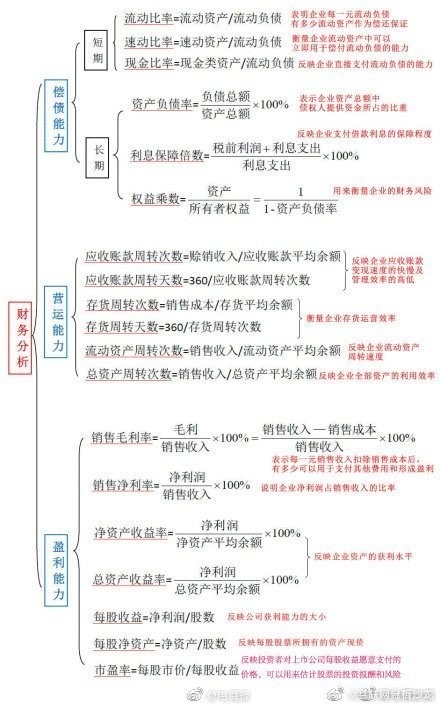

1. 资产质量分析: 分析资产中有没有"水分",也就是资产的含金量有多少;
2. 负债分析: 负债的真实性以及表外有没有游荡着的负债;
3. 利润质量分析: 分析利润中的真实含金量，别尽整些虚头巴脑的不见现金的利润;
4. 现金流分析: 分析现金流是否正常,日子过得潇洒还是紧巴巴，甚至借债度日。

马靖昊说会计:  财务分析可以搞得与推理小说一样好玩，但只能怀疑，不能得出确定的结论，毕竟结论是要有证据来支持的，而纯粹的财务分析是不可能取得证据的，它只能起到查账推理的线索作用。

有人问财务分析时，资产负债表重要还是利润表重要？刚好手头上有一个案例，两位在人品、身高、长相上都差不多的小伙子追求同一位姑娘，一个是收入高但家在农村的外企高管；另一个是某部长的当公务员的儿子。最终她选择了部长的儿子，类比报表，前者利润表好，后者却是资产负债表好，现实就是这么残酷！

对企业进行财务分析时，一些非财务信息有时显得更为重要。比如通过水表、电表以及运单可判断企业的生产、销售能力，可能比分析收入和利润更为有效；通过员工工资水平可判断企业的竞争优势和发展前景；通过银行借款可判断企业的诚信度；通过供应商账期可判断企业在其产业链中的地位及其行业竞争能力。

来源：https://card.weibo.com/article/m/show/id/2309404188957465296374?_wb_client_=1

