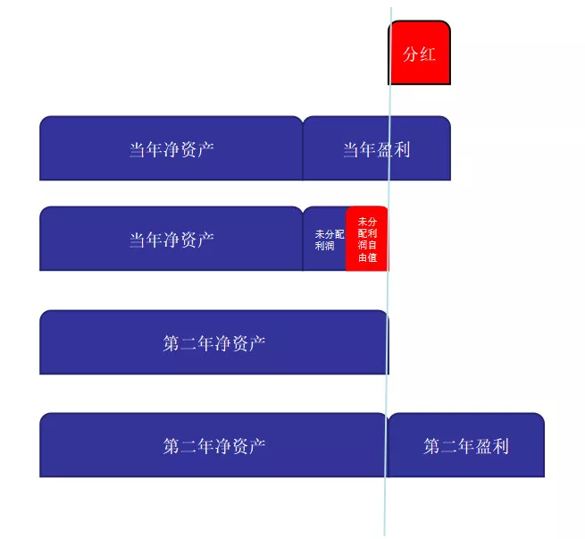

从2020年往前看农业银行过去5年滚动PE和PB，如果看PB，我们发现农行目前的PB在历史最低值。但是如果看PE，我们会发现农行的在机会值和中位数之间，并不是那么低估。

问题出在那了？越来越低的PB其实表明银行的盈利能力在持续下降，资产越来越重，但是ROE在下降。市场不可能按照净资产去给银行估值。而PE的相对稳定，表明市场看重的是银行的盈利能力，而不是资产。基本上是按照利润进行估值的。

下面我们看一个例子，一个企业，如果初始资本是1000万，头一年的利润为200万，ROE为20%，每年都不分红，存留利润继续发展，但是后续每年都只能产生200万的利润。五年后，资产为2000万，利润还是200万。在第五年的时候，这个企业的ROE为10%，应该说也不低。那么这个企业该如何估值呢。如果你不能对这个企业进行清算，这样企业的PB显然会持续下降；PE 估计也会下降，但是幅度会比PB下降的少。

为什么他的PE也会下降呢，这是因为他的利润不是自由现金流。利润是不能分配的，如果分配了，会导致来年利润下降。这样的企业像不像很多银行股。

这样的企业显然不能用PB估值，用PE估值也会有失真。应该用自由现金流进行估值。

巴菲特讲过自己现金流折现估值更多是一种估值思想，而不是真的要计算出企业的自由现金流是多少。因为很多企业的自由现金流是很难计算的。但是如果我们真要基于自由现金流去估值，那么还是要算一算的。

如果要对银行进行自由现金流估值，那么该如何计算其自由现金流呢。成熟的自由现金流计算公式无法套用。二马自己定义了一个银行股的自由现金流计算模型（也适合保险股）

模型如下：

A. 分配的利润作为自由现金流；

B. 未分配利润的自由值

A+B 为当年盈利中的自由现金流。

其中B的计算公司如下：第二年盈利/ 首年ROE - 当年净资产

如果第二年的ROE 不变，那么B = 当年存留利润，表示存留利润全部是自由现金流。

如果第二年ROE 提升，那么B> 当然存留利润，表示企业盈利能力加强，这个时候，自由现金流大于存留利润。

如果第二年ROE下降，那么B< 当年存留利润，表示企业盈利能力下降，存留利润中只有部分是自由现金流。

基于自由现金流PE估值的核心是自由现金流计算，至于PE给多少，要看杠杆率/资产质量/成长性及个人风险偏好。

来源：https://mp.weixin.qq.com/s/e83t4IJGc1FnY-iPbYge1Q?xueqiu_status_id=150947694&xueqiu_status_source=htl