**研究总结：**

一、零售行业是非常古老的行业，其本质是货物的搬运工，将商品从生产厂家层层批运到消费者手中，在这个链条赚取中间差价。在过去，由于科技水平、人力物力等等条件不够好，零售业的效率非常低下，随着物流效率的提升和信息化技术的进步驱动着零售行业向着集约化、规模化的方向发展，以沃尔玛为代表的超级市场崛起。进入到21世纪，以移动互联网和AI技术、现代物流为载体，超大规模的电子商务平台崛起，电商以其无与伦比的规模效应、对传统供应链的大大压缩、以千人千面为代表的高效撮合交易极大提高了零售业的效率和用户体验，线上零售逐渐取代线下零售，传统零售业态疲态尽显，但过去十几年电商发展的黄金时期却有一家生鲜超市连续10年逆势保持近20%的复合增长，目前已发展成年营业收入超过800亿元的全国性超市巨头，并且在2020年营收大概率超过目前行业营收规模最大的高鑫零售成为行业第一，它就是永辉超市。

二、永辉超市所在的中国生鲜超市市场是数万亿级别的超大市场，多维度的保守估算数据表明永辉超市还有至少3倍到15的成长空间。国外历史经验也表明零售行业空间大的惊人，沃尔玛在成为全国第一后国内营收依然34年内暴涨400倍，股价暴涨91倍。真正拥有极致成本控制能力与供应链壁垒的行业龙头可以通过不断的管理创新与科技应用提高经营效率，规模效应不断凸显，进而不断提高市占率。零售行业是典型的于长长的坡，厚厚的雪，容易产生长牛股的好行业。

三、作为目前全国唯一一家有全国扩张能力的超市，以生鲜为特色的永辉超市有着优异的公司治理与企业文化、不断深耕的供应链壁垒、良好的激励机制造就的行业领先的人效，在每年新投入大量人力物力完成中高速成长的前提下依然常年保持行业最优的人效、坪效与三费率，其真实利润相比报表利润要高出不少，在传统线下超市行业的竞争中没有任何对手可以匹敌。而低毛利、易损耗的特质使得电商自营生鲜很难快速侵蚀生鲜市场，虽然基于AI的大规模即时配送平台未来将取代一部分到店需求并极大改善用户体验，但电商在整个链条当中颠覆的仅仅是需求端的撮合和最后一公里物流而已，电商生鲜自营在供给侧方面对于供应链相比线下商超并无优势，在未来很长一段时间内，永辉超市将继续保持全国范围内的中高速开店速度。

在保持高速开店的同时，永辉超市将继续深耕供应链壁垒，通过科技应用与管理创新提高经营效率，通过提高规模效应、直采比例、自有品牌比例、高毛利的服务业收入占比提升利润率。

四、假设永辉超市未来5年内营收保持20%的复合增长，5年后整体营收规模将是现在的2.5倍左右，由此带来对供应商的议价能力和服务能力的提升，尤其是叠加新进薄弱区域的毛利率提升，保守估计零售业毛利率由近年平均的16.5%的水平提升至17.5%，占营收比例为90%。永辉服务业收入占比从现在的7%提升到10%，毛利率保持90%，届时永辉超市综合毛利率会达到24.75%。假设其三费率由目前的19%缓慢上升到21%，那么其净利率可以达到3.75%。届时永辉大概率还会保持中高速的开店速度，现金流良好、需求稳定、行业空间极大的超市龙头保守给与25的PE估值。那么2025年底其市值会达到860亿（19年预估营收）*2.5*3.75%*25=2016亿，大概是现在724亿市值的3倍，即6年3倍，每年20%左右的复合增长。

# **第1章**  **他山之石与前车之鉴**

## 1.1 沃尔玛的四大发展阶段

复盘沃尔玛的发展历史，可以分“区域发展-全美扩张-全球扩张-受电商冲击缓慢发展”四大阶段。

初创期（1962-1980）：1962 年山姆又在阿肯色州开出了第一家沃尔玛商店，并开启了早期的区 域扩张之路，1972 年，沃尔玛在纽交所上市，充足的资金储备为进一步扩张奠定了基础。早期沃尔玛坚守“农村包围城市+区域密集”战略，充分利用自身的区位优势，在竞争者较少、成本较低的乡镇地区加速扩张。截至 FY1980，沃尔玛的门店主要集中在阿肯色州、密苏里州、俄克拉荷马州等位于密西西比河中下游、乡镇分布较多的地区。

全美扩张（1981-1990）：上世纪 80 年代，美国经济实现高速增长，零售行业 借宏观经济东风也迎来了自己的黄金时代，10 年间全国零售总额从 9754 亿美元增长到 18446 亿美元，复合增长率为 6.6%。依托行业快速增长的 红利，沃尔玛（WMT.N）从精准定价、优化供应链、完善内部机制等三方面构建竞争壁垒，通过持续不断的建设完善物流系统和信息系统（发射卫星）来提高经营效率。

全球扩张期（1991年2009）：90 年代初期，面对美国经济下滑、国内零售市场趋向饱和的挑战，沃尔玛（WMT.N）开始将商业版图扩张至海外，通过自建、合资、兼并等方式，巩固 规模优势、推动国际化扩张。到2009年，沃尔玛的国际营收占比已达到22%的水平。2000 年，沃尔玛开发了电商平台并推出网上商城。

2009至今：稳定发展时期：以亚马逊与阿里巴巴为代表的电商巨头崛起，受市场饱和与电商冲击，沃尔玛稳定发展时期，高速成长不再。

## 1.2 沃尔玛在四个发展阶段的财务表现：

### 1.2.1营收与利润表现

初创期（1962-1980）FY1968 至 FY1980，沃尔玛年销售额从 1260 万美元增长到 12.5 亿美元，复合增长率高达 46.7%；净利润从 50 万美元增长到 4120 万美元，年复合增长率为 44.4%，沃尔玛在 FY1980 一举成为美国唯一一家营收超过 10 亿美元 的区域性零售公司。

全美扩张（1981-1990）沃尔玛的营收从 FY1981 的 16.4 亿美元增长到 FY1990 的 258.1 亿美元，复合增长率高达 35.8%，净利润从 0.6 亿美元增长到 10.8 亿美元，复合增长率 39%，最终于 FY1991 超越西尔斯成为美国最大的零售企业。

全球扩张期：（1990-2009）营业收入从 FY1990 的 258.1 亿美元增长到4012亿美元，净利润从FY1990 的10.8 亿美元增长到134亿美元。

2009至今：稳定发展时期。营收从 FY2010年 的 4050 亿美金增长到5103美金，净利润由143亿美金回落到99亿美金。国际营收占比由22%提升到25.6%左右。

### 1.2.2经营效率表现

沃尔玛过去三十多年来科技应用（现金的物流系统与信息系统的应用）与管理创新（合伙人机制）使得经营效率不断提升，在快速扩张阶段其人效与坪效不断提升，周转率不断提升，费用率却稳步下降，近年来受电商冲击导致费用率提高，利润水平有所下降。

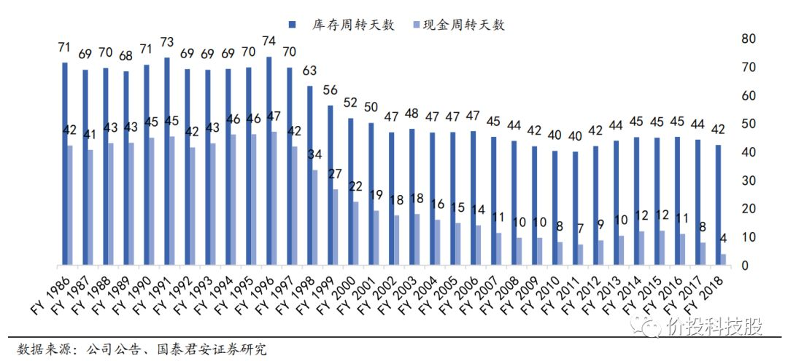

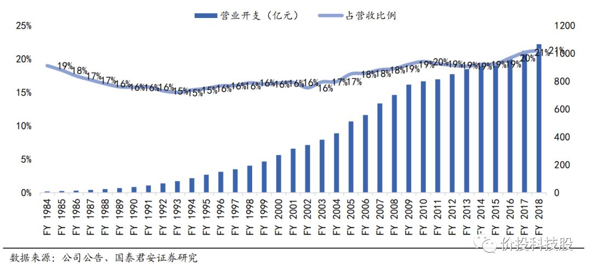

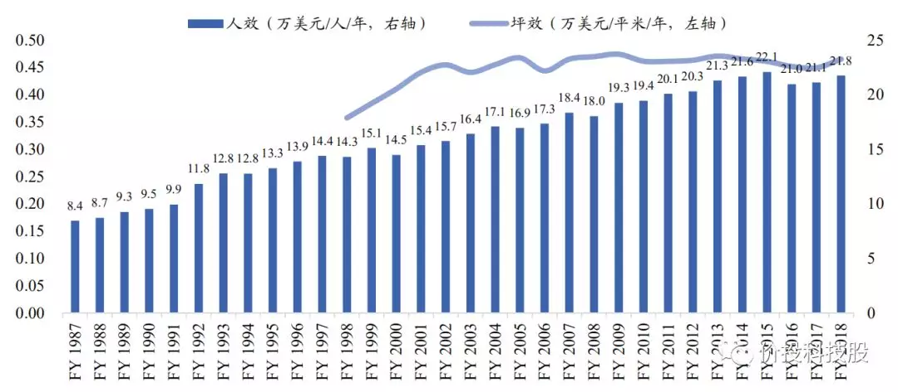

## 1.3 日本便利店的发展经验

便利店是另外一种常见的零售业态，日本便利店行业全球领先，寡头垄断格局稳固。全球零售250强中便利店企业共11家，其中日系便利店与其代理商占据5席，7-11及其代理商企业2015年营收658亿美元，占比61%，处于绝对领先地位。类似的日系便利店同样是通过提高物流效率来提高经营效率，从日本便利店的配送效率提升可见一斑。

## 1.4 他山之石与前车之鉴：

复盘行业龙头与先驱沃尔玛的发展历史，不难得出以下几条经验：

（1）零售业天花板非常高，沃尔玛在1980年成为全国龙头后40年的时间内营收仍然从10亿美元增长到5000亿美元左右，即使是扣除25%左右的海外收入国内增长也将近400倍左右。1986年年初，沃尔玛的股价是1.28美元，2020年1月29日，沃尔玛的股价是116.6美元，34年涨了91倍。零售行业属于典型的长长的坡，厚厚的雪。

（2）零售行业看似无技术含量（电商巨头重构了零售的供应链，以其超大规模的平台效应充分利用了AI技术极大提升了分销效率了用户体验，打造了消费者、买家、卖家共赢的生态圈，完全是一种新的商业模式，在此先不做深入探讨），但是实际上是受益于技术发展，可以通过综合运用各类技术尤其是现代物流与信息技术提高经营效率，实现规模效应与商业壁垒，行业龙头护城河足够深，可以不断提高市占率。

因此零售行业一定是效率取胜，无论是沃尔玛，还是好市多，亦或是阿尔迪，拥有极致成本控制能力的企业才能在零售行业的长跑中取胜，而成本控制取决于供应链优化、科技应用、规模效应、激励机制。

（3）电商对于传统零售的影响非常巨大，即使强如沃尔玛也在与电商巨头的竞争中占据劣势，近年来营收止步不前，利润有所下滑。

（4）中国电商相对于落后的传统零售更为强大，参考美国经验，中国传统零售企业如果要赢得互联网巨头的挑战，以下几个方面是核心：

①　独特的商业模式足以应对互联网的侵蚀，如好市多的会员制，永辉超市的生鲜超市。

②　效率机器：通过供应链优化、科技应用、管理激励等手段提高人效、坪效与电商抗衡。

 

# **第2章**  **永辉超市深度分析**

 

## 2.1永辉超市简介：生鲜引流，不惧电商，高速成长

如下图所示，永辉超市是全国唯一一家过去十年能够在电商竞争下保持高速发展的全国性连锁超市，目前其门店已扩张到28个省的926家门店，并且在2020年营收大概率超过目前行业营收规模最大的高鑫零售成为行业第一。永辉超市的生鲜占比行业最高，且质优价廉，生鲜的低毛利、高频次消费特性可以为更高的食品百货引流，这也是永辉过去多年来能够逆势成长的重要原因之一。

 

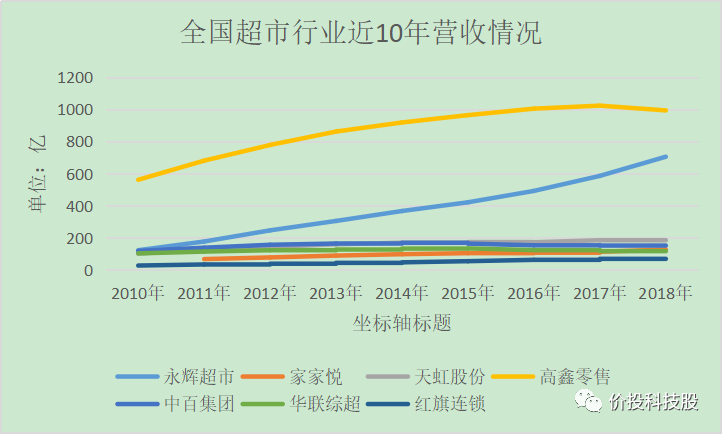

## 2.2永辉超市行业空间估算

由于无法准确估计永辉超市的生鲜超市的行业空间，我们仅以几个维度来综合估算。

2.2.1通过国内同行数据测算

2018年，红旗连锁营业收入72.2亿元，其业务范围仅在四川省内，且主要集中在大成都范围内。2018年，家家悦营业收入127.3亿元，其中威海、烟台两地级市的营业收入约100亿元；2019年，家家悦威海、烟台两大成熟区域仍保持着净开店和4%以上的同店增速。对比永辉2019年在28省预计实现约854亿元营业收入，省均营业收入约30亿元，未来提升潜力大。保守估计其省均收入仅和家家悦威海、烟台两地级市的营业收入相当，其营收还有3.3倍的提升空间。

2.2.2对比美国同行数据测算

根据2019年的最新数据，中国社会消费品零售总额411649亿元，全美去年社会消费品零售总额达62375.57亿美元，可以看到中国的社销和美国的社销总量差不多，但中国电商相对实体零售更为发达，虽然永辉在过去电商发展的黄金十年依然没有受到太大影响，反而是电商取代落后线下零售的受益者，但仍然保守估计其营收只能达到沃尔玛国内营收的一半，即2000亿美元约1.4万亿人民币左右，其营收还有15倍左右的增长空间。

2.2.3通过进驻城市测算

中国地大物博，县一级的城市2851个，永辉超市目前才进入四百出头，保守估计即使其已经进入的区域密度不增加，未来营收也还七倍的增长空间。

2.2.4永辉超市市场空间总结

可以看出，无论是哪种估算角度，只要永辉超市能够像过去一样高速持续扩张，其营收起码还有3.3倍-15倍的空间。由于我们的估算方法非常保守，大概率还会超过整个数字。要知道，沃尔玛在成为全国龙头后其国内营收在未来的34年里仍然暴增了400倍。当然，前提是永辉超市在未来数十年内仍然能保持行业龙头的地位，这取决于永辉超市的核心竞争力与护城河。

 

## 2.3永辉超市核心竞争力分析

2.3.1企业文化

创新、纠错、共享的企业文化：永辉的企业文化结合了阿里与腾讯的优点，既有阿里的不断折腾与创新，又有腾讯的开放与共享精神。其创始人张轩松反复在历次股东大会上强调要把永辉超市打造成共享平台，赋能青年人，共享科技、形成共享平台，希望通过科学分层引进菁英成为平台合伙人同时中基层实现帮助年轻人创业，通过管理，从员工从就业者变成创业者，让他们实现自主创业简单创业。永辉的合伙人制就将这种共享理念体现的淋漓尽致。而另一方面，永辉又不断创新、试错与迭代，无论是辉腾系统、彩食鲜、超级物种、永辉生活、永辉买菜、永辉迷你、永辉金融、还是永辉超市的工坊系列都体现出管理层试图结合新科技来满足年轻人的新的消费需求，对比业内其他传统零售企业，领先的不是一点半点。

 

2.3.2优异的公司治理

公司治理是一家公司能够基业长青的制度保障，永辉超市无疑是零售行业中公司治理最为优异的企业。其目前已采用和华为类似的轮值董事长制度。其主要股东包括牛奶国际（20.21%）、京东（11.56%）、腾讯（5.06%）、张轩松（14.87%）、张轩宁（7.86%）。其中牛奶国际系亚洲著名的零售集团，经营业态包括超级市场、大型超市、便利店、美健产品零售店及家居用品店。永辉超市目前并无实际控制人，但其主要股东包括了全球零售业巨头、互联网巨头及电商巨头、创始人张氏兄弟，这种复合背景在当前数字化经济转型的大环境下有助于管理层做出更好的决策，使得其管理层既能吸收全球优秀零售集团的发展经验，又能够获得互联网巨头的支持与思维。

 

2.3.3不断加深的供应链壁垒

经过19年来的不断深耕，永辉超市的生鲜供应链护城河进一步加强。生鲜虽然具有高频消费的优势，但其毛利低、损耗率高、流通环节长，因此供应链壁垒很深。

具体而言:永辉超市拥有行业最高的生鲜销售占比，其直采比例高，供应链条短，生鲜采购规模行业第一，采购标准化程度高（公司已形成了长达 842 万字的严格标准化的生鲜采购部培训手册），人均采购额不断提高，物流配送方面永辉超市已形成全国化物流配送网络，支撑其全国门店的拓展。此外，近年来永辉超市还进一步入股上游企业锁定优质供应，不断加深其供应链壁垒。结合其合伙人制度，目前永辉超市的生鲜损耗率可以做到全行业最低。在生鲜供应链方面，包括电商巨头在内全国无出其右。

 

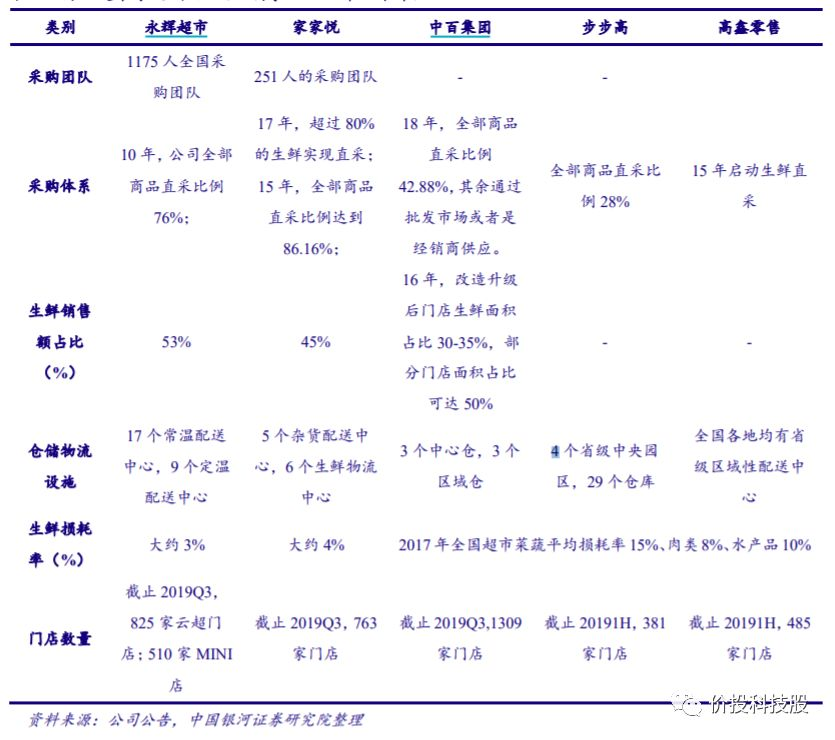

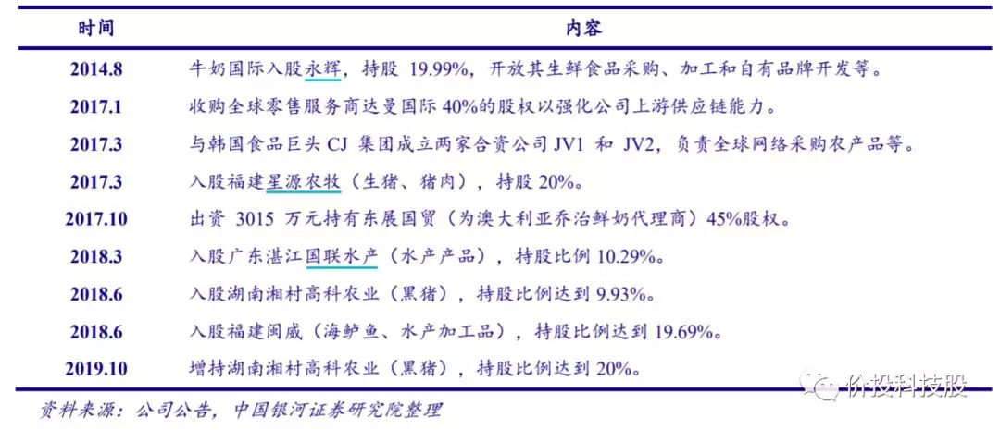

2.3.4合伙人制+赛马

永辉超市从2012年开始试点“合伙人制度”，2016年合伙人制度已经在全公司范围内推广。合伙人制度本质上是对员工的变相股权激励，充分调动了员工的自主意识，吸引优秀的年轻人为公司事业奋斗。

合伙人制度具体实施方案为：每个门店分为十几个小店（包括前台业务部门和后台部门），每个小店由5+1或者6+1个合伙人组成，每个小店在一定范围内有用人权，每个小店内部选举出一位店长，每个大店也有一位店长。

合伙人制度的精髓在于激励与考核是紧密相连的：考核分为大赛马制和小赛马制，大赛马制是指第一集群和第二集群之间的竞争，每个季度或半年进行一次PK，优胜的集群才能得到总部更多的资源倾斜。小赛马制是指每个大店和小店都有明确的KPI（包括收入增速、利润、存货、损耗率等指标），每个季度同区域内相似的小店之间要进行PK，考核等级分为ABC类，连续两次考评为C的小店或大店就要重新选举店长，原来的店长降级为合伙人。而激励方面，超额利润的50%全都用于给合伙人分红。

总的来说，合伙人制度既赋予员工业绩竞争的压力，又赋予员工超额利润高比例分红的激励，使得员工的自主意识和服务意识明显增强，既减少了很多不必要的费用，又提高了用户体验满意度，永辉全面推行合伙人制后人效提升明显。但相比好市多和沃尔玛，公司的人效仍有大幅提升空间。

## 2.4永辉超市财务分析

永辉超市的人均创收持续保持行业领先，尤其是在16年全面推进合伙人制度改革后。

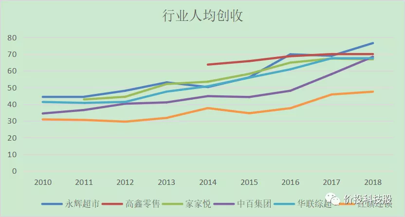

永辉超市在每年新开大量店铺、新铺开业初期营收不佳的不利情况下，总面积坪效依然保持稳定，且远高于目前收入规模第一的高鑫零售，而高鑫零售的坪效自2013年持续下行，与永辉超市的差距越拉越大，这也能解释为何高鑫零售无法再进行大规模扩张。

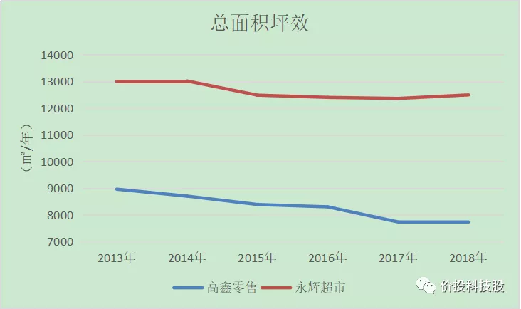

永辉超市的存货周转天数保持行业领先，另一家生鲜占比较高的超市家家悦和永辉的情况类似，这和生鲜的周转要求比较高有关。

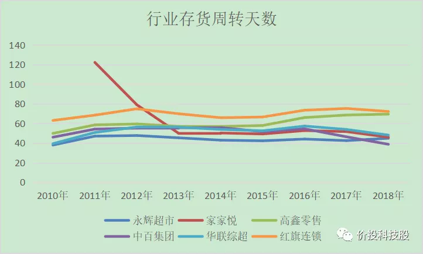

  永辉超市的应收账款周转率不断下降，但主要是由于保理所致，剔除该影响后净营业周期也是负的。

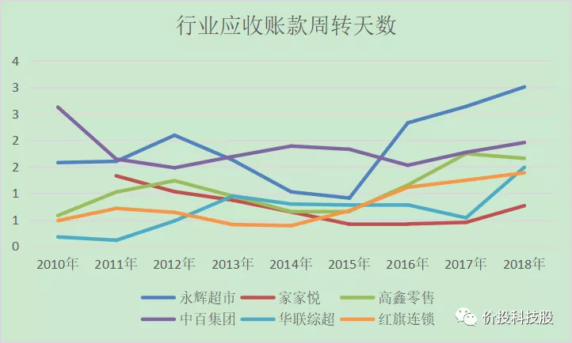

超市行业规模效应明显，高鑫零售应付账款账期很长，体现龙头对于供应商的议价能力很强。

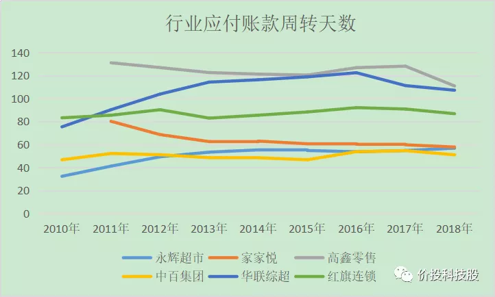

超市行业营业周期整体是负数，对上下游都有一定的议价权，现金流较好。

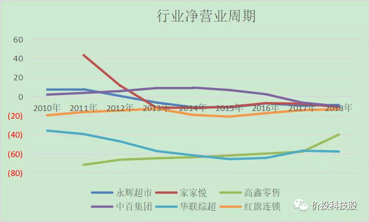

行业近年总资产周转率整体呈下降趋势，生鲜占比高的永辉和家家悦周转率较高，但账期（应付账款周转天数）比较低。

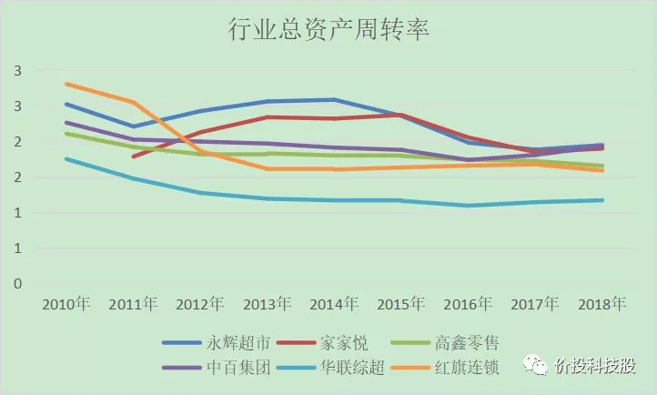

在过去十年来房价高速上涨的情况下，永辉超市的租金水平保持小幅上涨，而由于转租比例的提高，永辉超市过去5年的净租金水平呈下降趋势。以一家5000平米的永辉超市计算，其一年的净租金水平在100万左右。永辉超市多数开在当地繁华的购物中心里，一年一百万的净租金实在不算多。事实上，由于永辉超市的生鲜对于购物中心具有很大的引流聚客作用，购物中心往往愿意给永辉很优惠的租金，而永辉的转租收入越来越高也说明永辉超市的引流作用越来越好，这本身也是永辉开创的生鲜超市商业模式的组成部分。

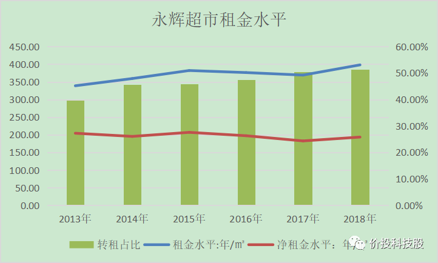

近10年来行业的毛利率稳步上升，而生鲜占比较高的永辉和家家悦毛利相对较低。

永辉超市的三费率长期保持在行业最低水平，18年由于股权激励导致费用率大幅提升。

永辉超市的毛利率过去5年保持缓慢提升的趋势，毛利率的提升主要是毛利较高的服务业占比提升，而零售业的毛利率保持稳定。未来毛利率的提升取决于服务业收入占比能否进一步提升，永辉超市年报中提到服务业收入主要由转租收入与对供应商的服务组成，目前来看还有进一步提升的趋势。

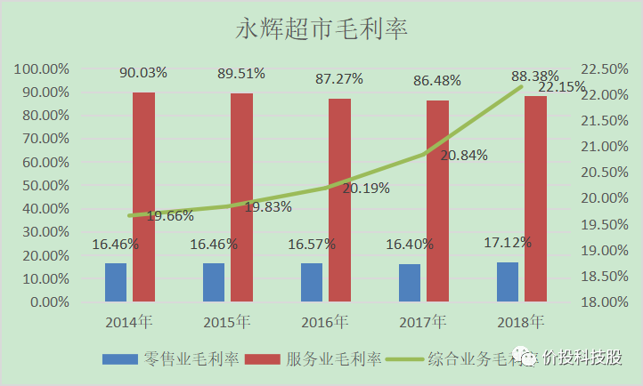

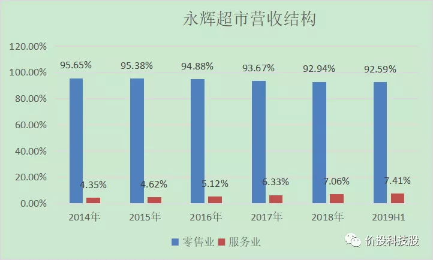

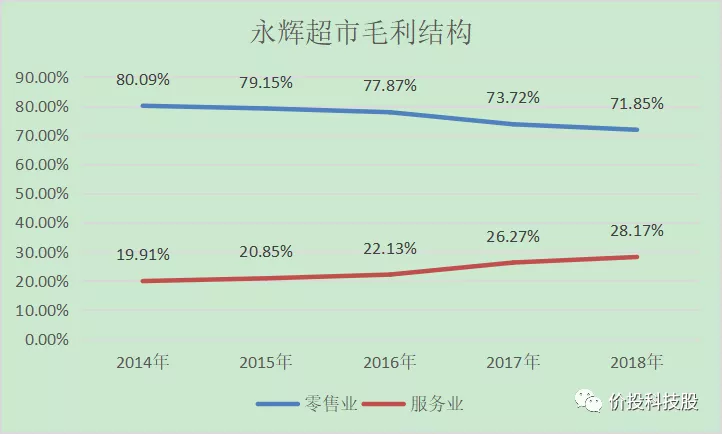

### **永辉超市财务分析总结：**

**永辉超市在营业收入增速长期保持行业一骑绝尘的情况下，每年投入大量资金、人力、物力到新开店铺中，总体经营效率还保持了行业第一的经营效率：人效最高、坪效最高、三费率最低**。如果永辉像其他行业竞争对手一样停止扩张，其实际利润要高出报表利润不少，但今天的投入是未来明天的增长，参考目前行业规模第一的高鑫零售，当永辉超市的规模继续扩大，规模效应会进一步凸显，其应收账款的账期也会更长，对供应商能提供的服务会更多，因而服务业收入占比也会更大，毛利率和净利率会进一步提升，利润会随着规模加速释放。

## 2.5电商对永辉超市威胁的定性分析

生鲜电商是万亿级别的市场，且生鲜高频次的购买属性是电商梦寐以求的流量入口，在线上增长陷入放缓的情况下，各路资本纷纷涌入生鲜电商的风口。

电商之所以在过去十年能够快速渗透，因为电商符合零售业的本质：多快好省。具体而言电商相对实体零售有以下几个显著的优势：

①无限品类，快速查找，购物体验极大提升；

②由于电商对于供应链的压缩和重构叠加快递的高速发展，线上购买成本优于线下，且时间成本少，综合成本低；

③电商平台边际成本几乎为零，龙头强者恒强，可以快速占据绝大部分市场。

**但在生鲜电商行业，这几点统统不成立，唯一的变量是以美团、饿了么为代表的以AI驱动的大规模即时配送系统****的出现。**

①由于生鲜的非标性，线上的购物体验并不能显著优于线下。

②目前即时配送虽然有很大发展，但是生鲜品毛利低，配送成本会吃掉大部分毛利，再加上生鲜的高损耗率，导致99%的生鲜电商很难赚钱。

③生鲜电商本质是重资产属性，因为生鲜是重资产运营，需要供应链的深耕、需要冷链物流系统的支撑，一切都快不来，即使是行业龙头也无法在短时间内大幅提升市占率。

于是就有了以下表格中的一系列死亡名单：

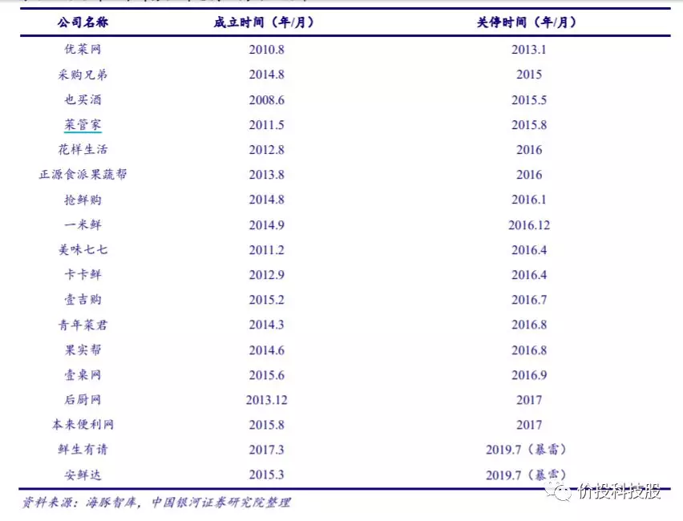

事实上，电商在过去十年的黄金发展并没有给永辉造成多少负面影响，反而加速了永辉的开店速度。在电商的竞争下，没有护城河的传统超市盈利不佳大量关店或者放缓发展速度，永辉超市才能趁虚而入，长期保持了20%以上的复合增长。生鲜行业的规模足够大，当电商无法快速席卷这个市场时，永辉超市大概率可以在很长的一段时间内保持中高速的开店速度同时不断加深其护城河。

当然，以产业终局的角度来思考，个人认为线上平台最终能够颠覆人类的买菜习惯，当以美团、饿了么的以AI驱动的大规模即时配送系统规模效应凸显，配送成本不断下降，甚至是自动驾驶普及与无人机配送普及，由于人性本懒，线上买菜也终将成为习惯。但这并不会影响优质生鲜品牌的购买偏好，电商平台作为撮合平台与配送履约商，会分到产业链上一杯丰厚的利润但仅此而已，永辉的生鲜供应链足够强大，无论到店购买还是平台购买，消费者最终会选择最物美价廉的生鲜商品，大概率还是选永辉，只不过是线上购买而已。

## 对标公司

高鑫零售：被阿里收购，实力强

果蔬好

## 参考文献

https://mp.weixin.qq.com/s?__biz=Mzg5NTIzNDcyNw==&mid=2247483679&idx=1&sn=fab15b3e2be8e9116ac17aded5583f67&chksm=c01226d7f765afc1bd0ccf14efa3f4ea71af05e3f530dbe4eb96df5b364c0002a116f6692895&scene=21#wechat_redirect