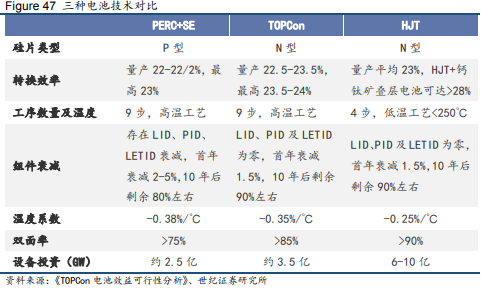

公司是光伏领域精密激光加工设备龙头，具备强势的市场竞争地位和过硬的产品竞争实力。公司主要产品为应用于光伏领域的精密激光加工设备，包括PERC 激光消融设备、SE 激光掺杂设备、MWT 系列激光设备、全自动高速激光划片/裂片机、LID/R 激光修复设备、激光扩硼设备等。公司主要产品的功能是通过控制光学损失和电学损失从而提升太阳能电池光电转化效率。公开信息显示，截至2018 年底，光伏电池厂商的PERC 工艺产能中约77%采用了公司的设备，SE 工艺产能中约86%采用了公司的设备，行业市占率高，龙头地位巩固。

## 布局

1）光伏行业有很好的基础，原有订单和新增产能的维护要保持：

l 消融和掺杂有90%以上市占率（原来消融70%多、SE 80%多），我们要固化好现有市占率，把该拿的产线都拿下；

l 依然会有新增产能。

2）光伏新的激光应用，希望有新的产品、技术的突破，带来收入增量：

l PERC+：有这么多的PERC产品，短期内一定要效率提高，所以一定要PERC+，PERC+主要就在激光技术上的突破。

l TOPCon是下一代技术，用到激光会更多，我们已经跟一些客户在进行研发拓展了

l 传统HJT没有钝化，不需要激光，但传统HJT做不出来是有原因的，我们在HJT部分其实也有些激光技术的应用

l 还有跟客户其他方面的研发不能对外说

3）在做其他行业的拓展，消费电子等行业都在进行（没做PCB），有些在客户论证、前期设计过程。我们是技术型公司，跟客户交流是技术先行。

## 研发

研发团队由创始人李总（海归物理学博士）带领，有光伏、OLED、光机电、软件、自动化的人才，有100多人，研发总部在武汉，无锡和以色列也有研发的子公司。

## 订单

今年总产能120-130GW，去年四季度看到30-40GW，很多订单在今年确认，明年交付（一/二季度），目前能看到明年订单，除了130GW之外还有50/60GW，但是我们相信明年一二季度一定有新的PERC或者PERC+带来新产能增加或者新产品的突破。100GW带来15亿左右掺杂和消融，尺寸变化会导致产线数量的变化，166要4-5条产线，210要3-4条产线就能完成（因为210单片发电功率增加了，所以1GW需要的产线和片数减少了）。

## 价格

210价格会上升，单GW投资不会有大的调整。我们市占率很好（消融、掺杂），客户对我们信赖度很高，客户发现了国内那一点点设备的价差不足以弥补问题，比如宕机或者效率达不到目标，不划算。

## 激光作用

用热的方式增加扩散、提升效率、打孔。

## 专业性

光伏只有我们在做激光，迈为在跟随，他们也能做消融，但我们公司消融2014年就量产交付了，而迈为去年才开始有一些订单。210我们去年底量产交付，迈为、大族没有产品交付，我们有很大的先发优势。光伏行业里的激光不是简单的激光，有十几道工序，要保证十几道工序增加激光设备后能有1-1.5%的效率提升，否则价格再低没意义，激光工艺、前后道工艺的确认和后道的匹配要结合起来。我们的激光是否能达到客户要求必须要整条线跑下来才能知道。

### PERC+技术

PERC肯定有新技术出来，不然这么大产能明年没法做了。新的行业、新的应用要用激光实现的东西一定会想到帝尔激光，其他没有任何一家。我们做的很多是原创性的技术，有的只是理论上的东西，我们要把它转化成实际产品时，确实存在一定的风险。我们在很多点有技术突破，最终一定有一些方向会成为主流。

### PERL技术

在消融、掺杂之后，还有背面的硼掺杂，使背面的接触更好。

l 消融、掺杂价格：1GW 1000多万

### 无损切割和LIR激光修复技术

16、17年都做过，只是当时用LED灯的方式应用更多，因为更便宜，但发现还是有些问题不能解决，所以我们在用激光的方式帮客户重新论证这一技术。希望无损、LIR成为未来方向。

无损切割价格&作用：100多万/台，1GW 5台左右。传统切片技术价格很低，只要40/50万，激光机械的荷载更好，但是客户对之前的切割已经有既有认识了，我们很难提价，虽说它可以降低功率的损耗，但客户可能认为这部分对他们没有太大的影响。我们主要作用是提升机械荷载，降低组件的碎片率。

#### LIR原理

是电池片做完以后加的一道工序，用强光的方式固化，让他自由性没那么好，减少全生命周期衰减。我们会想到做这个工艺是因为我们之前在PERC上也有，在PERC上能有0.15-0.2%的效率提升，但相对于消融和掺杂1-1.5%的总体效率提升来说，优势不太明显，所以没那么受关注。在异质结上优势会明显一些。

LIR价值量：不到500MW目前需要4台，按照价值量，1GW HJT单这一道激光就要3000万，未来产品量比较大的时候，价值量会下降。目前这个产品对我们来说有比较高的附加值，做的好的价值量能提升很多。

#### 客户&订单

现在在跟国外客户合作，已经落实到订单了，是不到500MW的中试线，REC用梅耶博格整套的产线，我们是跟俄罗斯的客户合作，他对我们LIR和无损切割比较感兴趣，马上有订单的是LIR。现在客户希望确保0.4%的效率提升，我们希望笼统一些，因为前面有四五个其他环节，希望签0.3%，之前只做了一部分（不到1000片）的论证，数据是客户给的，最终效率是多少我们这无法确定，需要他到组件端的确认。

LIR出片速度：对应1条线整体产能，激光提速方法比较多，可以通过功率增加或光斑缩小去实现。

### 激光转印技术

有效率的提升和银耗降低（因为银浆价格不断上升，未来希望用更细的银浆），希望能突破。

#### 原理

银浆覆盖上面，30-50um的激光通过一个介质（可重复利用）直接扫下去，和银浆完全无接触，银浆不会有损耗，激光打上去时会有瞬间的温度让银浆固化上去，把银印在电池片上。

银耗下降

根据去年上半年在客户那边的数据，PERC有30%以上的下降。HJT双面低温银浆耗量还需要确认（因为HJT本身的路线还没有完全确定），原理是一致的，我们希望给客户更多的选择，效率增加、成本下降。

客户感兴趣原因

现在想出的其它降低银耗的解决方法有：主栅用铝浆或者无主栅用细栅做（迈为无主栅是梅耶博格的smartwire方式）。主栅可以不用，但是细栅一定要，细栅只能用银浆，无法解决细栅的问题。丝网是用物理方式，会有效率极限，有些地方可能会接触不到，有断栅，对电池片也就没有意义了。所以我们一定要用其他方式做，这也是我们认为这一技术会有较好的发展前景的原因，因为越往前做一定要用更精细的方式实现，目前很多客户希望用激光做，因为能实现更精准的控制。

难点&推进：之前在客户那跑过，效率方面还是可以的，但当时量产没有做到很好的推进。客户也在重新评估，PERC已经发展到极致的时候，客户端一定对新的技术会有更好的接收度，所以目前我们在重新推这个技术，我们要替代是对原有技术完全的颠覆，我们之前在做166，现在想往182、210的尺寸做，光源或设计可能要改变，但原理已经走通了。

标致客户：去年、前年在天合、协鑫都有做过，现在换其他客户，也是龙头公司，主要还在PERC，异质结还没有。

信息披露少：大家没看到很多转印的信息，市场前景不明确，我们也希望保密，也希望在客户端有较好的论证了再发布更多信息。

### MWT

是很好的技术，最开始和阿特斯、亿力新能源合作，那时是荷兰的ECN在做这件事，但后来发现PERC技术性价比更好，所以MWT没有成为主流。MWT是在PERC电池的最前面做Laser Drilling（打孔）技术，但需要背板、玻璃厂商配合尺寸，变动比较大，所以目前只有少数客户在做，现在还有订单。“MWT+PERC”也是PERC+的技术，但不是非常主流的方向。江苏日托一直在做，今年也有新增产线，特定客户对这些产品有需求，我们跟他们的交流很多，确定会有新技术的出现，明年不可能全部淘汰掉，所以一定有PERC+。

### HJT&PERC路线之争

HJT如果没有新的突破，未来生存空间会很有限，传统HJT只能证明这条路线可以走，但跟PERC相比，它是否有更好的性价比不好说，一定得有新的工艺。HJT希望降低成本，更多寄望于产能的提升，而不是单台设备价格的降低，产能提升能否实现是问题，最终看每W成本，HJT和PERC没有1%的效率差是没有意义的，现在有PERC客户量产23.2%的效率。我们认为比较长的时间内PERC还是主要方向，所以着重在做PERC，HJT我也保证技术的跟进，在无损和LIR突破。因为原理相同，只是一个高温、一个低温，转印既然在PERC上有新的应用，那么在HJT上也不会有大问题，因为HJT是双面，它其实有更好的意愿，所以我们不认为这一路线会是大阻碍。

## 消费电子行业

机台已经在客户产线上跑，是国内非常大的厂商，类似于玻璃上的精细打孔，不是在玻璃面板行业的应用，客户也没跟我们说的很确切，这块没有人做过，比较保密，我们希望有确认的订单再说。

## 激光器

1）功率段：20-200w，固体激光器为主，高功率的基本用不到，波长比较短。皮秒也会用到，一开始用超快多一些，价格高，性价比没有优势，所以我们同时也在看国产替代（532或1064波长的激光）。

2）固体激光器供应商：跟我们联系比较多的有武汉安扬、深圳PI、上海国神等。

## 在山煤等新入局者的突破

问题是他整个工艺还没确定，在还没跑通的线上做新的突破对他们来说有难度，LIR和无损在成熟线上比较容易接受。

## PERC、HJT和TOPCon

**TOPCon电池横空出世**

在2019年的SNEC展会期间，TOPCon电池横空出世，受到了行业的焦点关注。TOPCon技术是在电池背面制备一层超薄的隧穿氧化层和一层高掺杂的[多晶硅](http://solar.ofweek.com/KW-duojinggui.html)薄层，二者共同形成了钝化接触结构。该结构可以阻挡少子空穴复合，提升电池开路电压及短路电流。

在工艺方面，TOPCon技术只需要增加薄膜沉积设备，能很好地与目前量产工艺兼容。同时TOPCon电池还具有进一步提升转换效率的空间，有望成为下一代产业化N型高效电池的切入点。根据理论计算，钝化接触太阳能电池的潜在效率（28.7%）最接近晶体硅太阳能电池理论极限效率（29.43%）。

可见，与PERC电池类似的是，TOPCon电池也在背面采用了钝化接触结构，增强了电池性能。而且在工艺方面，TOPCon电池以较小的成本获得了较大的效率上升。另外，TOPCon电池的未来效率提升空间巨大，是最接近晶硅电池理论效率值的电池之一。

## 结论

可以肯定的是，中短期内市场必然要面临PERC、异质结、*TOPCon*共存的一个产业格局。所以帝尔激光的策略是对的。

## 参考文档

https://xueqiu.com/2027325012/163300936

https://solar.ofweek.com/2019-06/ART-260009-8500-30395078_2.html

https://m.solarbe.com/21-0-326777-1.html

https://www.energytrend.cn/news/20200210-81820.html

http://guangfu.bjx.com.cn/news/20200506/1068775.shtml