## 中国城市发展潜力排名

来源|泽平宏观（ID：zepinghongguan）

作者 | 任泽平 熊柴 闫凯 李圳辉 白学松

实习生姜文镪、顾才鑫、徐灏等对本文有贡献

### 导 读

我们提出了业内广为采用的标准分析框架：“房地产长期看人口、中期看土地、短期看金融”。

当前中国城镇化正步入城市群都市圈时代，房地产市场已进入总量平衡、区域分化的新发展阶段，房地产长效机制加快构建、“一城一策”推行，城市发展潜力差异巨大，城市研究变得尤为重要。

本课题是我们历经一年多对经典框架的细化与量化，在前期60多个指标、超过10万条数据基础上筛出27个指标、约5万条数据，以此建立多维度、多层次、可验证的城市发展潜力基本面+市场面评价模型，对全国除三沙市及港澳台外的336个地级行政单元的发展潜力进行客观排名。

本研究对于认识城市发展潜力、政府构建长效机制、促进房地产市场平稳健康发展、居民安居乐业、企业投资决策等具有参考价值。

### 摘 要

研究背景与分析框架：房地产市场进入总量平衡、区域分化的城市群时代。1）背景：房地产进入新周期，城市发展进入城市群都市圈时代。中国20-50岁人口于2013年见顶，存量住房套户比近1.1和房地产长效机制加快构建，标志着中国房地产市场告别高增长阶段，进入高质量发展的新时代新周期。在中长期，城镇化、居住改善、城市更新三大红利将支撑中国房地产市场未来平稳发展。从区域看，中国进入城市群都市圈时代，区域分化突出，城市发展潜力差异巨大，城市研究价值更加凸显。2）分析框架：基本面分析趋势，市场面分析时机。基本面分析是城市发展潜力研判的核心，关键在于研判人口，逻辑链条是：人随产业走，产业决定城市兴衰，规模经济和交通成本等区位因素决定产业布局。我们在基本面关注需求侧的人口现状、人口潜力和人口购买能力，以及供给侧的住房存量及土地财政依赖度，共涉及23个指标。在市场面，用房价周期、需求透支率、库存去化、地价房价比等波动较大的4个短期指标研判城市市场热度，以在基本面分析基础上判断进入时机。根据历史数据回测，准确度为75%。

基本面：2019年中国城市发展潜力排名。1）榜单概览：2019年深北上广稳居中长期发展潜力榜单前4名，二线城市中成都、南京、武汉、重庆、天津、杭州位居前十；东部地区有32座城市进入前50名，长三角、珠三角地区表现尤其突出；东北地区有超八成城市位于200名之后。百强城市以全国13%的土地，集聚50%的人口，创造73%的GDP，占全国商品住宅销量的62%。2）人口现状：人口持续向大城市集聚，中西部核心城市崛起。从区域层面看，当前人口回流皖川桂豫等中西部省份与粤浙等东部省份人口再集聚并存，京沪津苏黑吉辽人口增长低迷甚至负增长。从分线城市看，人口持续向一二线大城市流入，三线城市全域流入流出基本平衡，四线城市持续流出。从重点城市看，深圳、广州、杭州常住人口大幅增长，西安、成都、长沙等中西部核心城市日益崛起，北京、上海、天津、苏州、无锡等东部城市人口增长放缓。3）人口潜力：人随产业走，一二线产业基础及潜力突出。一二线城市以25.5%的人口创造了46.5%的GDP，人口集聚潜力很大。在产业创新方面，一二线城市头部效应显著，上市公司占比、发明专利授权量合计分别占约70%、75%，其中京沪深占据绝对高地，杭州、广州、苏州、南京、成都等城市居前。在交通区位上，一二线城市占据交通枢纽地位，高铁始发终到趟数分别高达740、149趟，东部地区受益于自然地理和率先发展战略交通基础条件更优。在公共资源上，一二线城市优质教育、医疗资源密集，城市轨道交通提升城市运行效率。4）购买能力：一二线城市绝对购买能力较高，相对购买能力较低。从绝对水平看，一线城市人均储蓄存款、可支配收入分别高达11.5、6.6万元，远高于其他城市。从相对水平看，一线、二线、三线、四线城市房价收入比分别为20.8、10.6、8.4、6.0年，但一线城市因供给不足，房价并非由中位数收入人群决定，而是由高收入人群决定。5）住房供给：一二线城市住房供给偏紧，二三线土地财政依赖度较高。一二线城市住房供给偏紧、套户比分别为0.97、1.02，东北地区有过剩风险、套户比超过1.1。东部、中部土地财政依赖度较高，分别为57%、52%；二三线城市较高，分别为64%、50%。

市场面：2019年百强城市何时布局最佳？1）榜单概览：在基本面分析基础上，结合市场面情况将发展潜力100强划为3档，其中深北上广等15个城市为一档，成都、武汉等25城为二档，兰州、徐州等60城为三档。2）量价趋势：部分三四线城市需求明显透支，部分一二线城市成交量有所回暖、市场有望趋稳。已经历明显调整的部分一二线城市及周边房价将逐渐趋稳，如供给不足或存在一定上涨压力；前期受棚改货币化刺激销量暴增、而又缺乏基本面支撑的部分三四线城市存在调整风险。3）库存去化：西部地区、四线城市总体库存风险较高。从可售库存看，2019年1月一线、二线、三四线样本城市库存去化周期分别为11.7、10.5、11.4个月，三四线城市从2018年下半年以来有一定上升。从广义库存看，2017年西部地区、四线城市土地消化周期分别为2.5、2.1年。4）拿地成本：2018年地价房价比总体回落，少数城市仍较高。2019年3月百城样本中一线、二线、三四线城市住宅类用地成交溢价率分别为4.2%、21.6%、21.4%，其中二线城市连续4个月上行、三四线城市连续5个月上行。2018年一线、二线、三线、四线城市地价房价比分别为29%、25%、19%、13%，除一线城市较2017年小幅上升1个百分点外，二线、三线、四线城市分别下降7、5、2个百分点。

拥抱城市群，把握大趋势。以中心城市为引领的都市圈城市群更具生产效率，更节约土地、能源，是支撑中国经济高质量发展的主要平台，是中国当前以及未来发展的重点。2019年发展潜力百强城市中有96个位于19大城市群，有54个位于24个千万级大都市圈。从人均生产效率看，分规模人均创造GDP呈现规模从大到小的递减现象；1000万人以上的城市人均创造14万元的GDP，是100-300万人城市的2.1倍，是20万人以下城市的约5倍。在城市群层面，19个城市群的核心在于京津冀、长三角、珠三角、长江中游、成渝等5个城市群。预计到2030年，中国2亿新增城镇人口的约80%将分布在19个城市群，其中约60%将分布在长三角、珠三角、京津冀、长江中游、成渝、中原、山东半岛等七大城市群。在都市圈层面，24个1000万人以上的大都市圈以6.7%的土地集聚33%的人口创造约54%的GDP，其中上海、北京、深莞惠、广佛肇等都市圈发展潜力明显居前。在大都市圈之外，仍有两类三四线城市值得关注:一类是东部沿海地区经济实力比较突出的三四线城市，另一类是距离中心大城市较远、辖区或腹地人口规模大的内陆地方性中心城市，均多数位于城市群内。

实施真正的房地产长效机制，有助于市场平稳健康发展，这也是人民、政府、企业等各方的共同期盼。长效机制的关键在于人地挂钩、金融稳定和因城施策。对于人口持续流入、供地不足导致的房价过高城市，增加土地供应；对于人口持续流出、供地过多导致的库存过高城市，减少土地供应；通过人地挂钩实现供求平衡，解决此前人地分离、供求错配导致的一二线房价过高、三四线库存过高问题。从美国、英国、德国、日本、中国香港、新加坡等经验看，房地产过度金融杠杆化是风险之源，货币金融稳定是治本之策，要避免货币超发、杠杆过高和居民过度举债，通过货币、金融、税收、土地等多种手段，支持刚需和改善型需求，抑制投机型需求。

风险提示：模型预测存在一定偏差；部分指标尚未公布2018年数据，影响模型估计；旅游城市的逻辑与其他城市不同，模型未单独考虑。

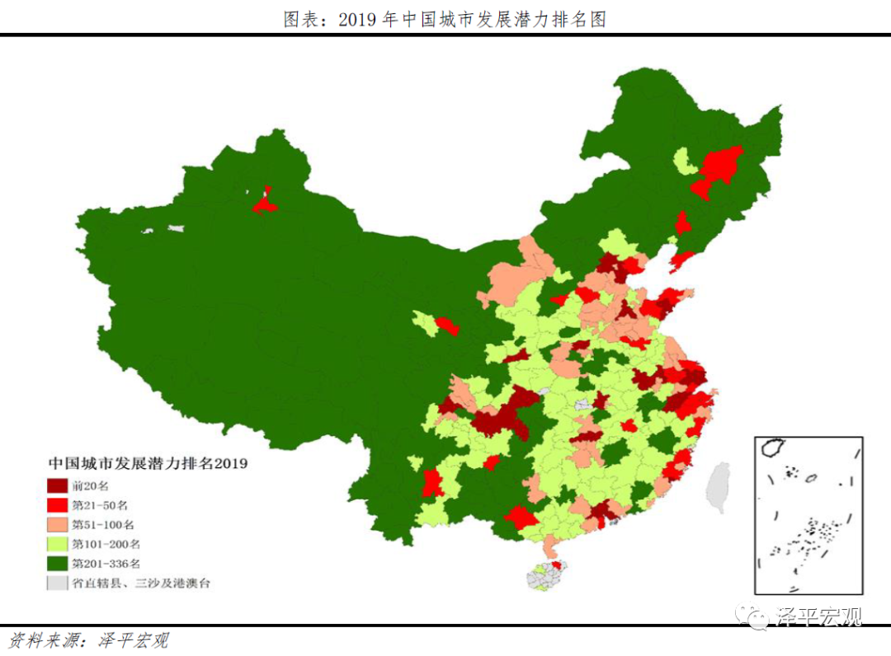

### 目录

1  研究背景与分析框架：房地产市场进入总量平衡、区域分化的城市群时代

1.1 研究背景：房地产进入新周期，城市发展进入城市群都市圈时代

1.2 分析框架：基本面分析趋势，市场面分析时机

2  基本面：2019年中国城市发展潜力排名

2.1 榜单概览：深北上广居榜首，区域中心城市及长三角珠三角表现突出，东北整体落后

2.2 人口现状：人口持续向大城市集聚，中西部核心城市崛起

2.3 人口潜力：人随产业走，一二线产业基础及潜力突出

2.4 购买能力：一二线城市绝对购买能力较高，相对购买能力较低

2.5 住房供给：一二线城市住房供给偏紧，二三线土地财政依赖度较高

3  市场面：2019年百强城市何时布局最佳？

3.1 榜单概览：发展潜力100强分3档

3.2 量价趋势：部分三四线城市需求明显透支，部分一二线城市成交量有所回暖房价趋稳

3.3 库存去化：西部地区、四线城市总体库存风险较高

3.4 拿地成本：地价房价比总体回落，少数城市仍较高

4 拥抱城市群，把握大趋势

### 正 文

#### 1  研究背景与分析框架：房地产市场进入总量平衡、区域分化的城市群时代

##### 1.1 研究背景：房地产进入新周期，城市发展进入城市群都市圈时代

从总体看，20-50岁人口于2013年见顶、需求峰值已过，存量住房套户比近1.1和房地产长效机制加快构建，标志着中国房地产市场告别高增长阶段，进入高质量发展的新时代新周期。在需求侧，中国20-50岁主力置业人群规模于2013年达峰值，住宅新开工面积2011、2013年达超过14亿平的双峰，2018年商品住宅销售面积达14.8亿平方米、大概率为历史峰值。按照当前人口发展趋势，中国人口总量将在2024年左右见顶，如后续鼓励生育，见顶时间也最多延迟到2031年。在供给侧，1978年改革开放以来，特别是1998年房改以来，中国城镇居民基本实现从筒子楼到住宅小区，从全民蜗居到基本适居的历史性跨越，全国层面的城镇住房套户比从不到0.8上升到接近1.1，表明住房短缺时代终结。在政策层面，房地产调控思路发生重大转变，逐渐从短期调控政策向长效机制建设过渡。过去20年，中国房地产调控目标在稳增长和控房价之间几经反复，调控思路重抑制需求轻增加供给、重短期调控轻长效机制，调控手段重行政调控轻经济手段，结果房价越调越涨。2016年12月中央明确定位“房子是用来住的、不是用来炒的”，开始提出建立促进房地产平稳健康发展的基础性制度和长效机制，房地产调控思路逐渐从短期调控政策向长效机制建设过渡，从全国一盘棋向因城施策过渡，从以商品属性为主向构建强调居住属性的住房制度过渡。

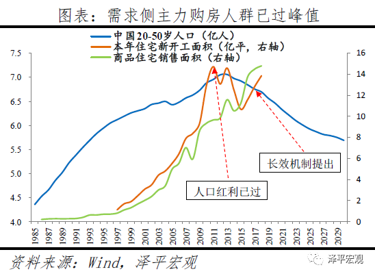

在中长期，城镇化、居住改善、城市更新三大红利将支撑中国房地产市场未来平稳发展。一是城镇化红利。2018年中国常住人口城镇化率为59.6%，与发达国家平均约80%的城镇化水平相比仍有较大增长空间，并且户籍人口城镇化率仅为43.4%，市民化空间更是巨大。二是居住改善红利。当前同时拥有厨房和卫生间的城镇住房成套率仅85%，且有20%的家庭居住在条件较差的平房，人均住房使用面积仅不到25平，与发达经济体存在明显差距。随着中国经济持续增长和收入提高，加之家庭规模日趋小型化，人均住房面积还将进一步增长。三是城市更新红利。随着住房存量市场日益庞大，住房存量更新、拆迁改造的规模将持续上升。总体来看，到2030年之前中国房地产市场年均需求将在11-13亿平方米左右，需求虽有下滑，但规模仍然很大。

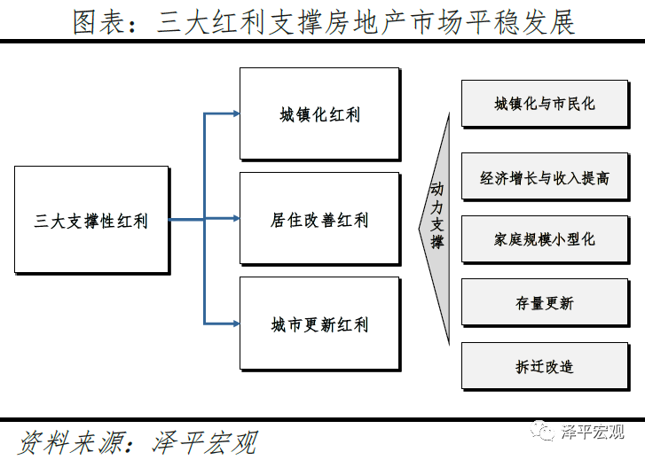

从区域看，中国进入城市群都市圈时代，区域分化突出，城市发展潜力差异巨大，城市研究价值更加凸显。在住房短缺时代，城市的发展潜力差异不大，但在住房总体平衡时代，城市的发展潜力则呈明显不同。住房存量套户比低、产业活力强、人口持续流入的城市显然更具发展潜力，而住房存量套户比高、产业不振、人口持续流出的城市缺乏发展潜力。在这一背景下，研判不同城市的发展潜力至关重要。从国际和中国经验看，人口迁移分为两个阶段：从乡村到城市迁移，到在城市化中后期明显向都市圈城市群迁移。虽然中国从2006年“十一五”规划开始提出以城市群作为城镇化的主体形态，但明显推进城市群建设则开始于2014年启动的新型城镇化建设，19个城市群规划相继出台。2018年11月，国务院《关于建立更加有效的区域协调发展新机制的意见》要求，建立以中心城市引领城市群发展、城市群带动区域发展新模式，推动区域板块之间融合互动发展。鉴于当前多数城市群发育不成熟，中央把以大城市为核心的都市圈作为城市群建设的突破口和抓手。2019年2月，国家发改委发布《关于培育发展现代化都市圈的指导意见》，要求以同城化为方向建设1小时通勤圈，标志着中国进入城市群都市圈时代。事实上，过去几年一二三四线城市房价走势明显分化，正是城市发展潜力呈明显差异的直接表现。一二线城市房价因人口大幅流入、土地供给不足在2015-2016年暴涨；三四线城市一度库存高企、后因去库存政策等在2017-2018年大涨。

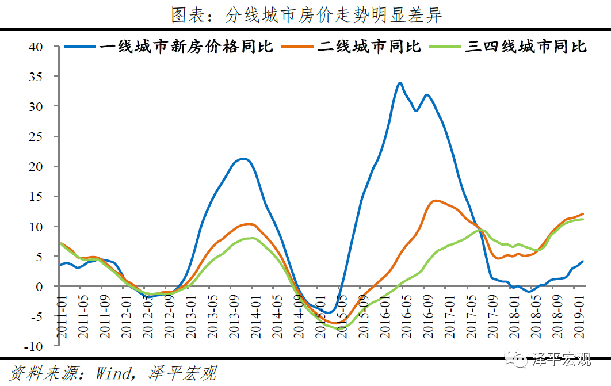

1.2 分析框架：基本面分析趋势，市场面分析时机

在“房地产长期看人口，中期看土地，短期看金融”的经典框架基础上，我们从“基本面+市场面”两个层面分27个指标研究2019年中国336个地级行政单位发展潜力（不含三沙），具体以基本面研判城市中长期发展潜力，以市场面辅助择时。

基本面分析是城市发展潜力研判的核心，关键在于研判人口趋势，逻辑链条是：人随产业走，产业布局决定于区位。其一，房地产长期看人口，人口决定需求。人口是一切经济社会活动的基础，更是房地产市场发展的根本支撑。由于出生人口大幅下滑，2018年中国人口仅增加530万，人口总量将在2024-2031年见顶，各地区已逐渐进入人口争夺的存量博弈时代。人口迁移的根本动力在于实际收入和生活水准差距，一般规律是人随产业走、人往高处走。其二，产业决定城市兴衰，产业兴则城市兴，产业聚则人口聚。当前中国经济从高速增长阶段转向高质量发展阶段，从全球价值链的中低端向中高端转型升级，区域产业格局明显变化。从地区层面看，东部沿海大量制造业受成本上升影响，已经并正向中国内地、东南亚转移。从城市群角度看，发达城市群内核心城市集聚高端制造和高端服务业、向周边转移一般制造业，发育中都市圈城市群制造业继续向核心城市集聚，城市群外一般城市产业结构多呈现低端制造业化和低端服务业化。其三，区位决定产业布局，规模经济和交通成本决定区位。企业产业布局以最大化利润为目标，区位选择至关重要。但区位因素并非一成不变的，随着规模经济和交通成本等因素变化。中国东部沿海地区率先发展的关键并非是率先开放的政策，而是沿海的地理位置有利于出口；从全球看，约60%的经济总量集中在沿海100公里范围内。高端制造和高端服务业聚集在核心大城市，主要是因为规模经济带来的成本下降和效率提高。

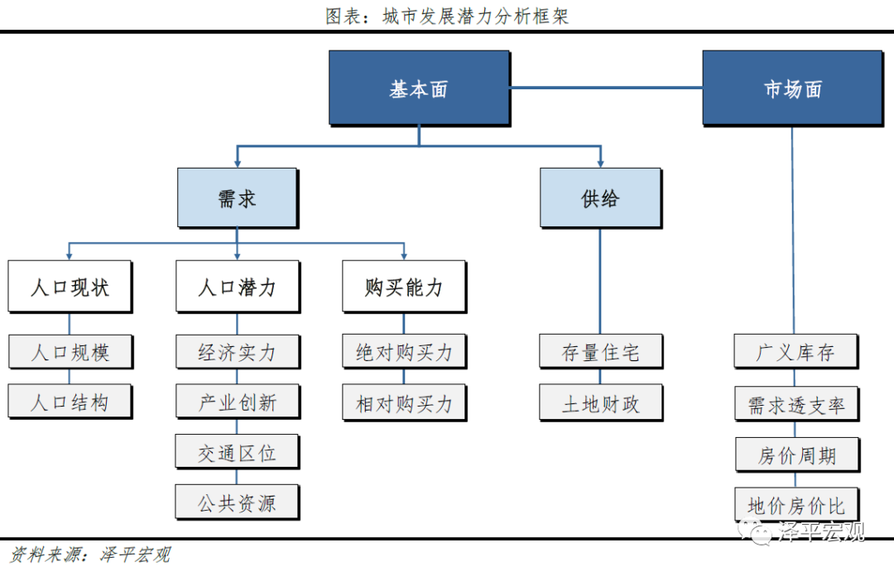

具体来看，我们在基本面关注需求侧的人口现状、人口潜力以及人口购买能力，以及供给侧的住房存量及土地财政依赖度，共涉及23个指标。其中，人口现状分为总量和结构两个维度，后者包括外来人口、人口年龄结构、城镇化率、小学生等指标。基于“人随产业走，人往高处走”的基本逻辑，我们从经济实力、产业创新、交通区位和公共资源四个方面分析人口潜力。除经济总量外，我们以经济-人口比值（区域经济份额/人口份额）作为反映经济层面的总体人口吸引力，以A+H股上市公司数、发明专利授权量反映区域先进产业及创新能力，以高铁始发终到趟数、高速公路路网密度、到中心城市距离等反映交通区位，以在校大学生数、执业（助理）医师数、城市轨道交通里程路网密度反映教育、医疗、公共交通等公共资源情况。在购买能力方面，我们关注绝对水平的人均储蓄存款、人均可支配收入以及相对水平的房价收入比。在供给侧，我们关注套户比和土地财政依赖度两个指标；其中，套户比反映存量住房市场的总体平衡程度，土地财政依赖度反映地方政府对房地产的依赖及与此相关的土地出让偏好。

在市场面，用库存去化、房价周期、需求透支率、地价房价比等波动较大的4个短期指标研判城市市场短期波动，以在基本面分析基础上判断进入时机及优先顺序。一些城市尽管从基本面上看中长期发展潜力较大，但如果短期需求透支严重，短期之内并无发展潜力。我们通过4个短期指标反映市场面，包括土地消化周期、房价周期、需求透支率、地价房价比等。由于可售库存数据不全，我们以土地消化周期这种广义库存去化指标反映城市住房库存。房价周期反映城市房价目前处于何种位置，是上涨中还是下跌中，以及相关持续时间。需求透支率即为当前住宅销售面积增速与过去几年增速的偏离程度，如果大幅偏离过去均值，则很可能意味着风险较大。地价房价比可大致反映房企当前拿地的预期成本收益比，不过如果缺乏人口和产业导入，地价房价比低的地区也缺乏发展潜力。

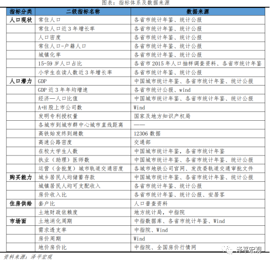

此外，短周期的金融指标多具有全国同一性、地区差异小，所以未纳入模型考量范围。金融政策（利率、流动性投放、信贷、首付比等）既是各国进行宏观经济调控的主要工具之一，也是对房地产市场短期波动影响最为显著的政策。住房的开发和购买都高度依赖银行信贷的支持，利率、首付比、信贷等政策将影响居民的支付能力，也影响开发商的资金回笼和预期，对房市供求波动影响较大。

本文所有的数据均来自于公开渠道，主要包括国家及各地方统计局、政府公开资料、Wind、部分房地产专业数据机构等。对部分地区或部分指标尚未公布2018年数据的情况，我们以2017年数据代替。

在数据处理上，为消除原始数据的量纲差异，对原始数据采取“最大值-最小值”方法进行标准化处理。其中，对于单调递增指标线性转换为0-100，对于单调递减指标逆向线性转换为0-100。

在权重处理上，采用层次分析法自上而下设置各级指标权重，并通过回测历史数据优化权重设置。在2015-2016年的数据回测中，模型对排名的准确度为75%，对指数的拟合优度为62%。

#### 2  基本面：2019年中国城市发展潜力排名

##### 2.1 榜单概览：深北上广居榜首，区域中心城市及长三角珠三角表现突出，东北整体落后

根据GDP、城镇居民人均可支配收入、以及城市政治地位等，将全国337个地级及以上单位划分为一二三四城市，其中三沙市因公开数据缺失较多而不在本文榜单范围内。一线城市为北上广深4个，2018年GDP在2万亿元以上；二线城市为除一线城市外的直辖市、多数省会城市、计划单列市以及GDP大于7000亿元且城镇居民人均可支配收入大于4万元的少数发达地级市共35个；三线城市为少数弱小省会城市和GDP在2000亿元以上的其他地级单位共85个；四线城市为GDP在2000亿元以下的其余地级单位共213个。

2019年深北上广稳居中长期发展潜力榜单前4名，二线城市中成都、南京、武汉、重庆、天津、杭州位居前十；东部地区有32座城市进入前50名，东北地区有超八成城市位于200名之后。百强城市以全国13%的土地，集聚50%的人口，创造约73%的GDP，占全国商品住宅销量的约62%。深圳占据城市发展潜力榜首，北京、上海、广州紧随其后。二线城市中，成都、南京、武汉、重庆、天津、杭州位列前10名；郑州、长沙、西安、济南、合肥等省会城市，厦门、青岛等计划单列市，苏州、东莞、佛山等发达地级市进入前20名。省会城市除呼和浩特、银川、西宁、拉萨外均排名前50。在前50名城市中，东部地区多达32个，中部、西部、东北地区分别有6、8、4个。除直辖市、省会城市和计划单列市外，前50名其余地级市大多分布在长三角、珠三角地区，其中长三角城市群8个，珠三角城市群4个，海西城市群、山东半岛城市群各2个。分地区看，东部、中部、西部地区排在200名之后的城市占比分别为4.6%、22%、64.1%；东北地区有30座城市位列200名之后，占本区域地级单位个数的83.3%，发展潜力总体靠后。需注意，各指标经标准化处理后合成的发展潜力指数仅具备序数意义。

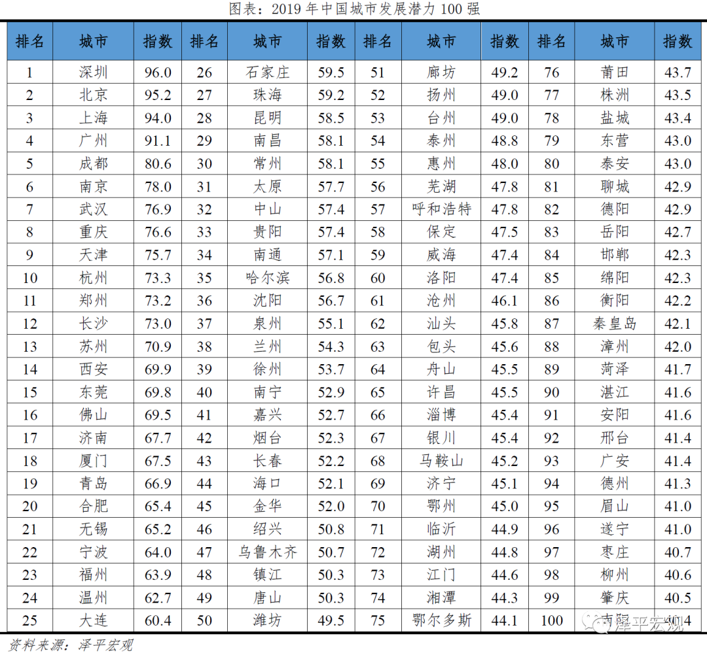

2.2 人口现状：人口持续向大城市集聚，中西部核心城市崛起

从区域层面看，当前人口回流皖川桂豫等中西部省份与粤浙等东部省份人口再集聚并存，京沪津苏黑吉辽人口增长低迷甚至负增长。改革开放后至2010年左右，人口大规模向出口导向型的沿海发达地区流动。2010年以来，随着沿海地区产业转型升级、中西部地区产业承接以及老一代农民工老化，部分人口逐渐回流中西部，东部人口增速总体减缓，而东北地区人口开始负增长。当前人口回流明显的是安徽、四川、广西、河南、贵州等省，安徽常住人口年均增量从2000-2010年的-33万回升至2010-2015年的37万，再增至2015-2018年的60万，四川从-56万回升至32万，再增至46万。广东、浙江等省常住人口增长一度受人口回流而明显放缓，但2015-2018年人口重新明显集聚，当前年均增量分别为166、66万。江苏则从2000-2010年的54万降至2010-2015年的22万，2015-2018年为25万、无明显起色，江苏与广东的人口集聚差异类似经济发展差异，2016年开始两地经济总量逐渐拉大。

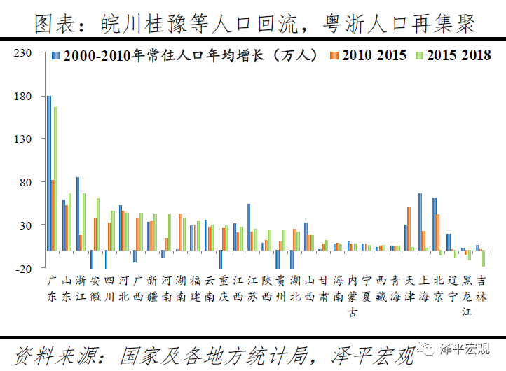

从分线城市看，人口持续向一二线大城市流入，三线城市全域流入流出基本平衡，四线城市持续流出。1982-2017年，一线、二线城市人口年均增速均显著高于全国平均水平，且一线城市增速更高，表明人口长期净流入、且向一线城市集聚更多。其中，1991-2000年、2001-2010年、2011-2017年，一线城市人口年均增速分别为3.9%、3.4%、1.5%，二线城市分别为1.9%、1.8%、1%，表明2011年以来一二线城市人口流入放缓但仍保持集聚，放缓的原因包括京沪控人、人口老化农民工回流等。上述三个时期，三四线合计人口年均增速分别为0.63%、0.29%、0.44%，而全国人口平均增速为1.04%、0.57%、0.52%，表明2011年以来人口虽有回流但仍在持续净流出。其中，2001-2010年、2011-2017年三线城市人口年均增速分别为0.50%、0.44%，基本持平于全国0.57%、0.52%的人口增速；四线城市人口年均增速均为0.14%、0.38%，明显低于全国平均水平。

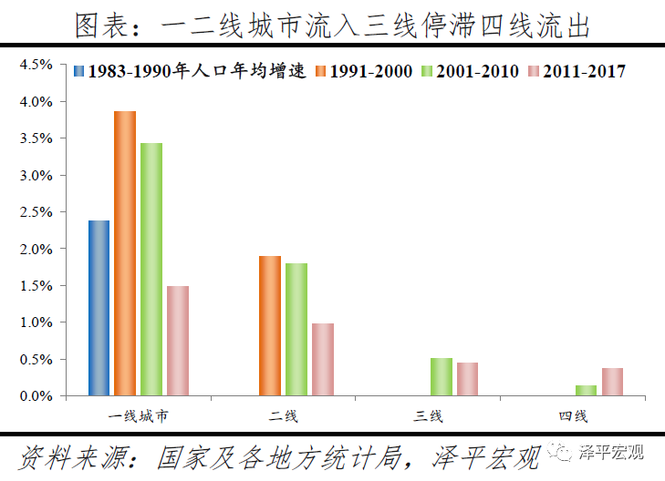

从重点城市看，深圳、广州、杭州常住人口大幅增长，西安、成都、长沙等中西部核心城市日益崛起，北京、上海、天津、苏州、无锡等东部城市人口增长明显放缓。过去二十年，城市的人口集聚格局发生深刻变化。除京沪从2013年开始主动控人外，其他城市近期多在“抢人”、但成效各异。2000-2010年，常住人口年均增量最大的前五个城市为上海、北京、苏州、深圳、天津，分别年均增加66、61、37、34、31万。2010-2015年，常住人口年均增量最大的前五个城市为天津、北京、上海、深圳、郑州，分别年均增加50、42、22、20、18万。2015-2018年，常住人口年均增量最大的前五个城市为深圳、广州、杭州、长沙、西安，分别年均增加55、47、26、24、23万；成都、郑州、重庆（主城）常住人口年均增加也超过15万，而传统的人口集聚大市北京、上海、天津、苏州、无锡年均增加不足5万，北京2017-2018年持续两年负增长、天津2017年一度负增长。

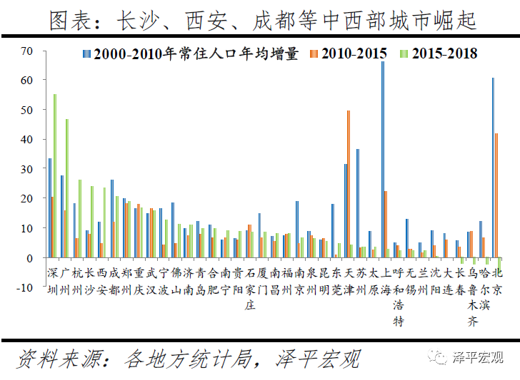

从户籍情况看，主要大城市外来人口众多、人口本地化空间很大，随着户籍制度改革深化推进有望释放部分住房需求。中央要求，除北京、上海少数超大城市外，其他城市均需放开放宽落户限制。当前常住人口与户籍人口之差大于500万人的有上海、北京、深圳、东莞、广州、天津6座城市，在200-500万人的有苏州、佛山、武汉、郑州、宁波5座城市，在100-200万人的有15座城市，50-100万人的有18座城市。上述44城或为直辖市、省会城市、计划单列市，或为长三角、珠三角、海峡西岸地区发达城市。近年在户籍制度改革和“抢人大战”的背景下，部分大城市户籍人口增长迅猛。2018年西安、成都、武汉、广州户籍人口分别较上年增加86.6、40.8、30.1、29.8万人，主要以户籍迁入的机械增长为主。

2.3 人口潜力：人随产业走，一二线产业基础及潜力突出

一二线城市以25.5%的人口创造了46.5%的GDP，人口集聚潜力很大。当前一线城市以5.2%的人口创造了全国12.3%的GDP，二线城市以20.3%的人口创造了34.1%的GDP，三线城市的人口份额与经济份额基本持平、分别为33.9%、34.0%，四线城市的人口份额明显低于经济份额、分别为39.7%、24.5%（因统计问题，地区GDP合计与全国存在差异）。从经济—人口比值来看，2017年一、二、三、四线城市分别为2.4、1.7、1.0、0.6；从剔除工业因素的第三产业-人口比值看，2017年一、二、三、四线城市分别为3.2、1.7、0.8、0.5。从经济增速看，2015-2017年，一线、二线、三线、四线城市年均经济增速分别为7.5%、7.9%、7.8%、6.8%，四线经济规模基数小、但增速仍然乏力。从区域看，近几年经济增速比较低的地区是辽宁、山西等数据挤水分地区及东北、西部等偏远地区，经济增速多在6%以下；而中部不少地区经济增速在8-10%之间，西南部分地区更是在10%以上。总体上看，未来人口将继续向大都市圈和区域中心城市集聚，三四线城市全域人口未来将继续大幅流出。

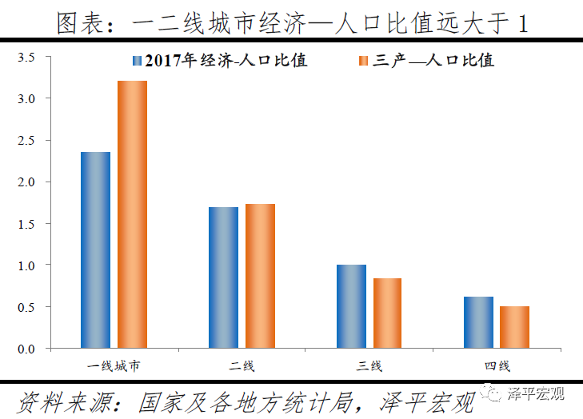

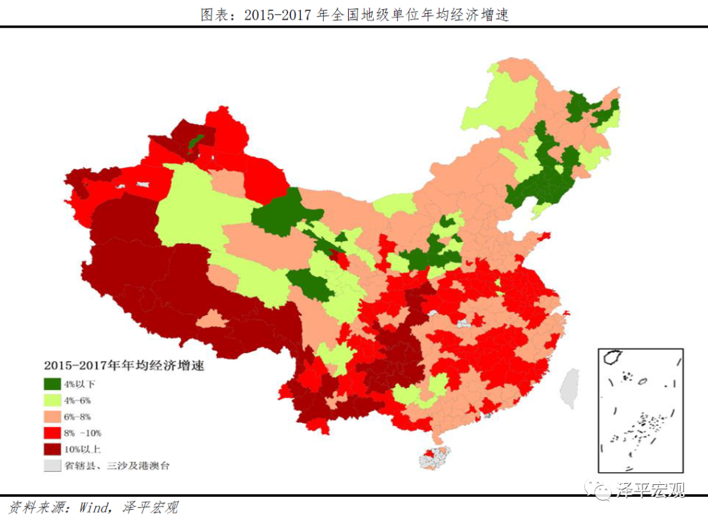

在产业创新方面，一二线城市头部效应明显，京沪深占据绝对高地，杭州、广州、苏州、南京、成都等城市居前。产业创新的城市差异比经济实力更加明显，这主要因为创新需要高度集聚才更有效率。从反映龙头企业的A+H股上市公司数来看，北京占全国的比重达10.7%，京沪深合计占比高达27.5%，一二线城市合计占69.9%。从发明专利授权量来看，北京由于占尽产学研资源优势而独占全国的14.4%，京沪深合计占26.8%，一二线城市占比达到75.5%。产业创新排名相对靠前的三线城市主要是绍兴、常州、台州、嘉兴、珠海等长三角、珠三角城市。

在交通区位方面，一二线城市占据交通枢纽地位，高铁日始发终到趟数分别高达740、149趟，东部地区受益于自然地理和率先发展战略交通基础条件更优。从自然地理看，东部沿海地区具有先发的区位优势。在东部率先发展战略下，高铁、高速公路等交通基础设施发展迅速，特别是珠三角、长三角、京津冀等地区。从高铁通达度看，一线、二线、三线、四线城市高铁日均通行班次分别为974、460、155、54趟；目前尚有107个城市未开通高铁，主要分布在中西部地区。从高铁日始发终到趟数看，一线、二线、三线、四线城市分别平均为740、149、17、6趟，其中广州、上海、北京、深圳、成都、武汉、重庆、天津、长沙、西安位居全国前十。从高速公路看，一二线城市与三四线城市的路网密度差异仍然十分明显，分别为1001、506、330、99公里/万平方公里，四线城市仅为一线城市的10%。2016年国家发改委《铁路网中长期规划》要求，在“四纵四横”高速铁路的基础上，建设形成以“八纵八横”主通道为骨架、区域连接线衔接、城际铁路补充的高速铁路网。其中八纵是指沿海通道、京沪通道、京港（台）通道、京哈～京港澳通道、呼南通道、京昆通道、包（银）海通道、兰（西）广通道；八横是指绥满通道、京兰通道、青银通道、沿江通道、沪昆通道、厦渝通道、广昆通道。

在公共资源方面，一二线城市优质教育、医疗资源密集，城市轨道交通提升城市运行效率。公共资源是产业发展的配套，优质公共资源对人口有着明显吸引力。从教育看，直辖市和省会城市多拥有区域内最优质的中小学和高等教育资源，拥有的985/211大学数合计占全国的81%，拥有的在校大学生数量合计占全国的58%；其中，京津沪的一本升学率位居全国前三。从医疗资源看，一线、二线、三线、四线城市每千人口执业（助理）医师数分别为3.2、3.1、2.2、1.9，并且医疗资源的质量差异巨大，全国最优质的医疗资源主要集中在一二线城市。从城市轨道交通看，根据各城市地铁公司官网及发改委最新批复，至2019年3月全国已通城市轨道交通（不含有轨电车）的城市有35个，加上已批复未开通的城市则增至45个。二线城市中太原、呼和浩特、南通、泉州、烟台尚未开通城市轨道交通，三线城市目前仅温州开通。已批复未开通地铁的城市除太原、呼和浩特、南通3座二线城市外，还包含包头、徐州、常州、绍兴、金华、芜湖、洛阳等7座三线城市。

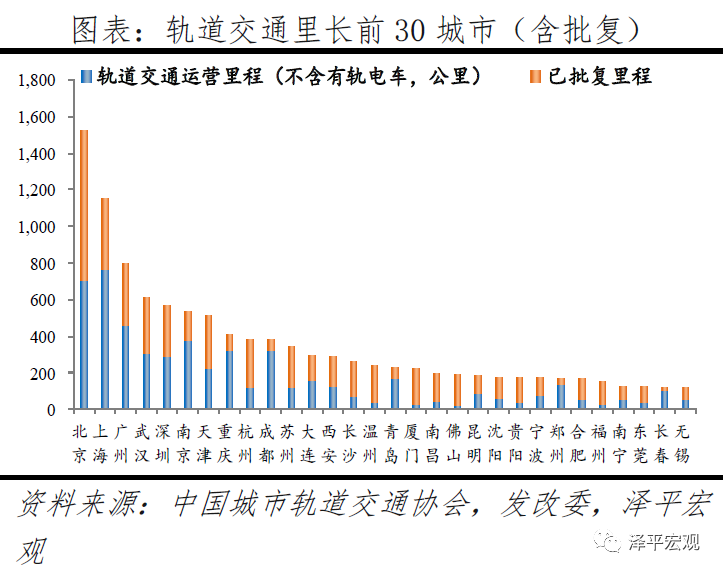

##### 2.4 购买能力：一二线城市绝对购买能力较高，相对购买能力较低

一线城市人均储蓄存款、可支配收入分别高达11.5、6.6万元，远高于其他城市。绝对购买能力不仅是可支配收入，还应包括人均储蓄存款，尽管当前“存款搬家”现象明显，但仍能反映相关情况。从城乡居民人均储蓄存款看，2017年一线、二线城市分别为11.5、6.6万元，三线、四线城市分别为4.1、3.2万元。从城镇居民可支配收入看，2017年一线、二线城市分别为6.4、4.5万元，三线、四线城市分别为3.6、3.1万元。此外，包头、鄂尔多斯、呼和浩特等部分资源型城市人均储蓄存款及可支配收入也较高。

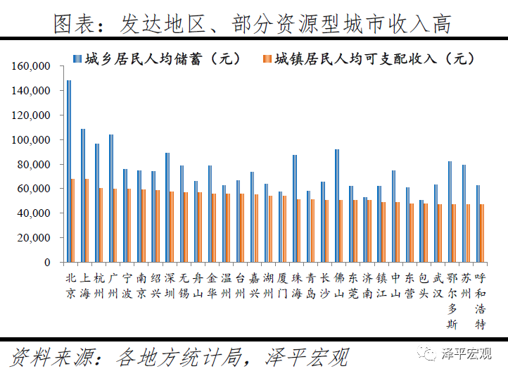

一线、二线、三线、四线城市房价收入比分别为20.8、10.6、8.4、6.0年；但一线城市因土地供给不足，房价并非由中位数收入人群决定，而是由高收入人群决定。2017年一线、二、三、四线城市房价收入比分别为20.8、10.6、8.4、6.0年，城市间分化显著，这与全球其他经济体核心城市房价收入比较高的情况一致。其中，北京、上海、深圳的房价收入比分别为26.5、22、21.4年；二三线城市中三亚、厦门、福州房价收入比也很高，分别为31.2、24.2、21.5年，三亚为全国旅游城市、房价主要受外来者购房影响。从原则上讲，在供需基本平衡的市场，房价由中位数收入人群决定；在供给明显大于需求的市场，房价由低收入人群决定；在供给明显小于需求的市场，房价则由高收入人群决定。并且，与国外明显不同，因文化传统差异，中国人购房存在“六个钱包”现象，即父母等对子女的资金支持通常较大，这使得传统房价收入比的度量存在一定偏差。不过，考虑到现实并无更好的指标及数据衡量相对购买能力，本文依然采用房价收入比度量。

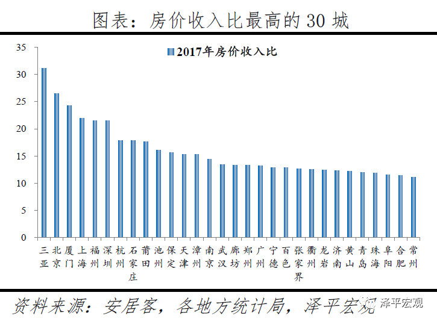

##### 2.5 住房供给：一二线城市住房供给偏紧，二三线土地财政依赖度较高

一二线城市住房供给偏紧、套户比分别为0.97、1.02，东北地区有过剩风险、套户比超过1.1。我们在2018年11月报告《中国住房存量测算：过剩还是短缺？》估算了2017年各省级、地级单位城镇住宅套户比。分地区看，2017年东部、中部、西部地区包括学生及其宿舍的城镇套户比分别为0.99、1.05、1.03，东北地区为1.13；东部、中部、西部地区不含学生及其宿舍的套户比分别为1.02、1.09、1.08，东北地区为1.17。分线看，2017年一线、二线、三四线城市套户比（含学生及其宿舍）分别为0.97、1.02、1.06，一二线城市住房供给偏紧。在全国336个地级单位（不含三沙）中，2017年有89个城市的套户比小于1，占比26.5%；有157个城市的套户比介于1.0-1.1之间，占比46.7%；有72个城市的套户比介于1.1-1.2之间，占比21.4%；有18个城市的套户比高于1.2，占比5.4%。

东部、中部土地财政依赖度较高，分别为57%、52%；二三线城市分别为64%、50%，高于一线、四线城市。土地财政依赖度在一定程度上意味着地方政府对房价的依赖。分区域看，东部、中部近三年土地财政依赖度（土地出让收入/地方一般公共预算收入）分别为57%、51.7%，高于西部、东北的31.6%、19.4%。这是由于西部、东北需求相对偏弱，房地产拉动经济的能力有限。分线看，二、三线城市近三年土地财政依赖度分别为64.2%、49.5%，高于一线城市的42.2%和四线城市的35%。其中，上海、深圳土地财政依赖度分别为25%、26%，而北京、广州达50%、68%。在全国336个地级单位（不含三沙）中，有16座城市土地财政依赖度大于100%，占比4.8%；有31座城市在70%-100%之间，占比9.2%；有98座城市在40%-70%之间，占比29.2%；有191座城市在40%以下，占比56.8%。

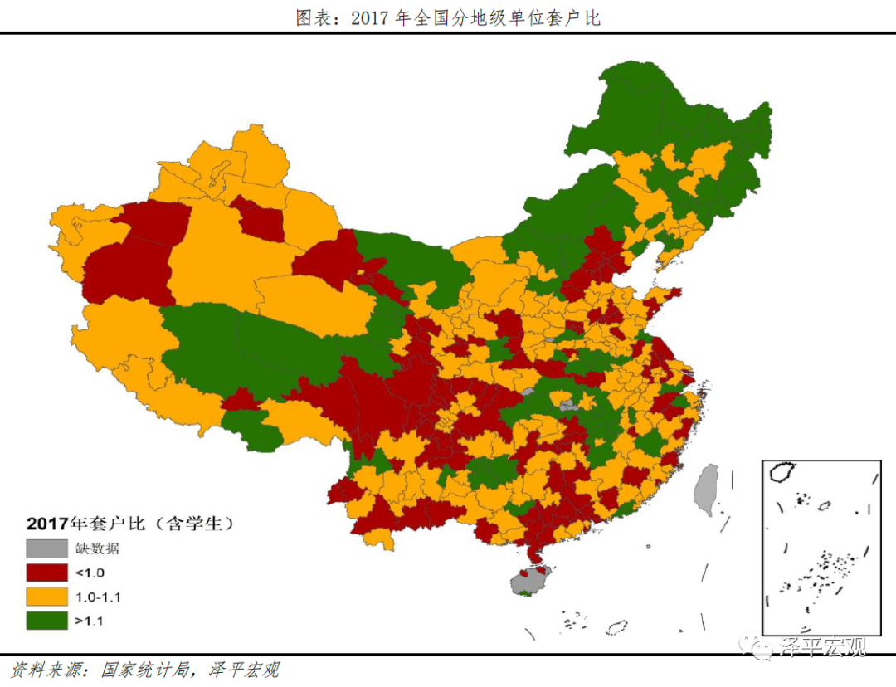

#### 3 市场面：2019年百强城市何时布局最佳？

##### 3.1 榜单概览：发展潜力100强分3档

在基本面分析基础上，我们结合市场面情况将发展潜力100强划为3档，其中深北上广等15个城市为一档，成都、武汉等25城为二档，兰州、徐州等60城为三档。市场面由库存去化周期、需求透支率、房价周期、地价房价比4项指标组成。我们首先将城市发展潜力100强按照发展潜力指数分为三档，再通过市场面指标分析，对当前市场趋势较好的城市升档，其他城市维持不变。

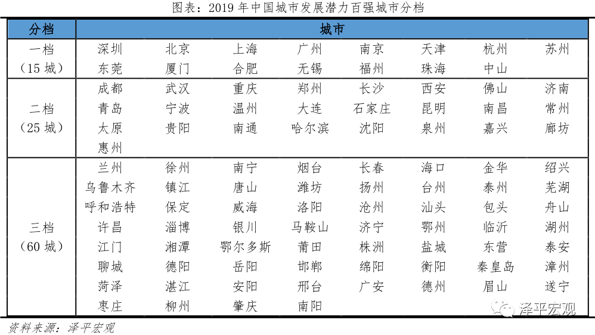

##### 3.2 量价趋势：部分三四线城市需求明显透支，部分一二线城市成交量有所回暖房价趋稳

前期受棚改货币化刺激销量暴增、而又缺乏基本面支撑的部分三四线城市存在需求透支风险。比如，一个城市过去3-5年的销售增速均在20%以下，在基本面改变不大的情况下，某年销售增速突然飙升，比如达到50%及以上，这种城市在短期存在需求透支风险，从数据看主要是部分受棚改货币化刺激的三四线城市。2017年以来，一线城市商品住宅销量明显下降，二线城市基本持平，三四线城市受棚改货币化安置比例扩大而继续暴增。各线城市销量暴增的时间呈现轮动特征，一线城市2015年商品住宅销售面积同比增长14%，二线城市2015、2016年分别增长10%、26%，三四线城市2016、2017年分别增长22%、13%，部分缺乏基本面支撑的三四线城市需求明显透支。

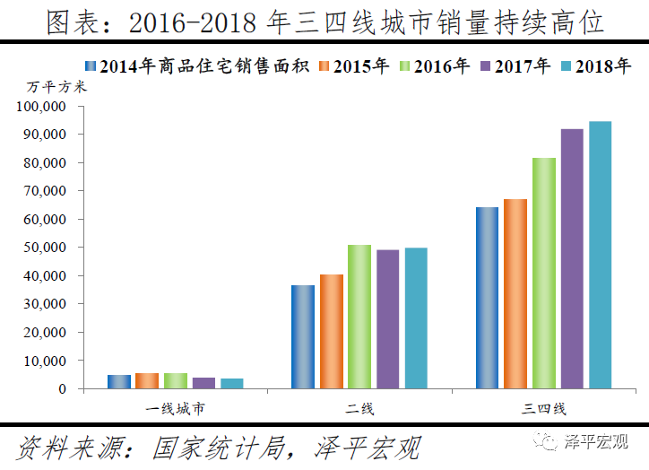

从房价周期看，前期经历明显调整的部分一二线城市及周边房价将逐渐趋稳，如供给不足或存在一定上涨压力。从历史经验看，过去不少城市的房价存在三年左右的小周期，涨一段调整一段，小周期的背后是房地产调控、地方对土地财政的依赖、需求释放与透支等因素。2015-2016年京津冀、长三角、珠三角部分城市及一些省会城市房价已连续低迷2年以上，目前成交量有所回暖，市场逐渐趋稳。此类城市在一线城市中有北上广深，二线城市中有天津、南京、无锡、苏州、杭州、济南、郑州、武汉、东莞等，三线城市中有廊坊、温州、嘉兴、珠海、惠州、中山等。而部分前期主要受棚改货币化刺激导致房价大涨、同时缺乏基本面支撑的三四线城市存在一定调整风险。

##### 3.3 库存去化：西部地区、四线城市总体库存风险较高

从可售库存看，2019年3月一线、二线、三四线样本城市库存去化周期分别为11.7、10.5、11.4个月，三四线城市库存去化周期从2018年下半年以来有一定上升。可售商品住宅数据可得性较差，我们选取分线样本城市进行分析。一线城市选取4城：北京、上海、广州、深圳，二线城市选取16城：天津、重庆、南京、武汉、成都、苏州、厦门、西安、长沙、宁波、福州、青岛、长春、杭州、济南、南昌，三四线城市选取9城：徐州、莆田、东营、芜湖、焦作、南平、三明、滁州、安庆。2015年以来，得益于棚改货币化政策三四线城市可售库存去化周期持续走低，2018年5-6月最低不到7个月，但逐渐上升。2019年3月，一线、二线和三四线城市可售商品住宅去化周期分别为11.7、10.5和11.4个月。需要注意的是，库存去化周期对销售非常敏感，比如部分城市商品住宅销量当前处于历史低位，一旦成交回暖，去化周期将明显下降。

从广义库存看，西部地区、四线城市库存偏高，2017年土地消化周期分别为2.5、2.1年。分地区看，东部、中部、东北地区库存持续改善，西部地区库存改善力度明显不足。2017年，东部、中部、东北地区土地消化周期均在1.15-1.35年之间，而西部地区则高达2.5年。分线城市看，2017年一线、二线、三线、四线城市土地消化周期分别为0.8、0.9、1.2、2.1。尽管一线城市受2016年930开始的调控收紧影响，市场销售持续降温，但土地消化周期基本小于1；四线城市销售乏力，土地供应持续增加，仍有较大库存风险。

##### 3.4 拿地成本：地价房价比总体回落，少数城市仍较高

近期土地成交有所回暖。2018年百城样本中一线、二线、三四线城市住宅类用地成交溢价率分别为6.1%、12.5%、18.1%，均较2017年的21.9%、38.3%、45.3%明显下滑。不过，从最近半年数据看，土地成交有所回暖，2019年3月百城样本中一线、二线、三四线城市住宅类用地成交溢价率分别为4.2%、21.6%、21.4%，其中二线城市连续4个月上行、三四线城市连续5个月上行。

地价房价比总体回落，但少数城市地价成本仍较高。2018年一、二、三、四线城市地价房价比分别为29%、25%、19%、13%，除一线城市较2017年小幅上升1个百分点外，二、三、四线城市分别下降7、5、2个百分点（由于地级层面的新房价格数据不全，在此以二手房价格分析，由此估计的地价房价比可能偏低）。尽管各线城市地价房价比总体上差距不大，但具体城市之间差异巨大。此外，当前部分城市推行的“限房价、竞地价”土地出让模式有效地平抑了新房价格，但在供给不足的情况下容易引起新房抢购。

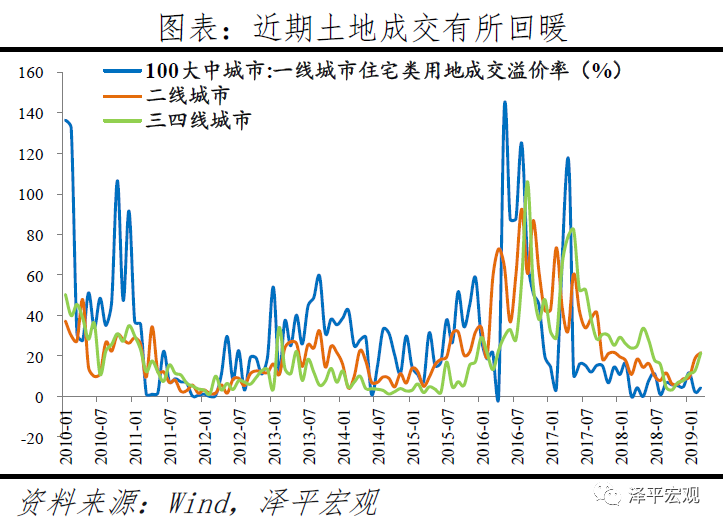

#### 4 拥抱城市群，把握大趋势

以中心城市为引领的都市圈城市群更具生产效率，更节约土地、能源，是支撑中国经济高质量发展的主要平台，是中国当前以及未来发展的重点。根据基本面排名，2019年发展潜力百强城市中有96个位于19大城市群，其中处于24个千万级大都市圈的有54个。2018年11月，国务院《关于建立更加有效的区域协调发展新机制的意见》要求，建立以中心城市引领城市群发展、城市群带动区域发展新模式，推动区域板块之间融合互动发展。以住建部城区常住人口为标准，将城市划分为1000万以上、500-1000万、300-500万、100-300万、50-100万、20-50万、20万以下七类。从人均生产效率看，分规模人均创造GDP呈现规模从大到小的递减现象；1000万人以上的城市人均创造14万元的GDP,是100-300万人城市的2.1倍，是20万人以下城市的约5倍。从人均城市建设用地看，大城市明显更节约土地资源，分规模人均创造GDP呈现规模从大到小的递增现象，2017年1000万人以上城市人均建设用地仅74.5平方米，而100-300万、20万以下城市分别为117.3、135.5平方米。

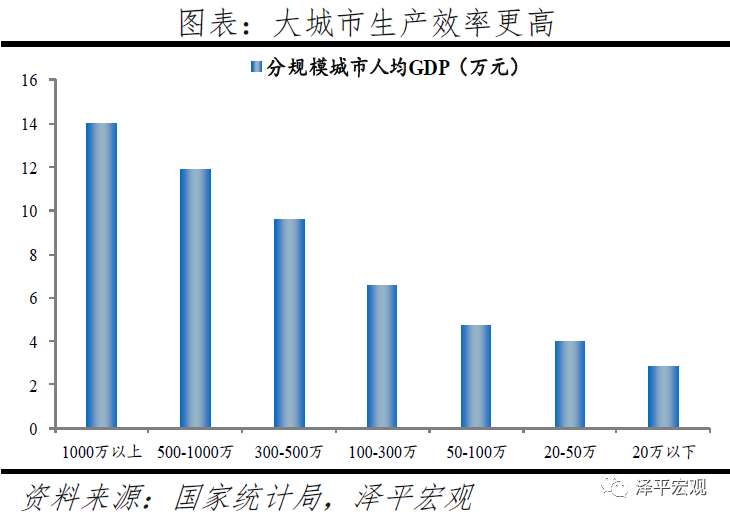

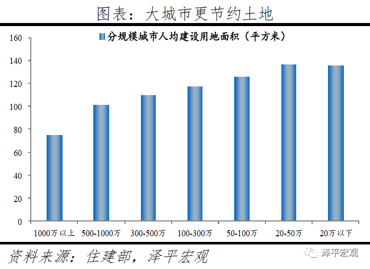

在城市群层面，19个城市群的核心在于京津冀、长三角、珠三角、长江中游、成渝等5个城市群。2014年《国家新型城镇化规划。

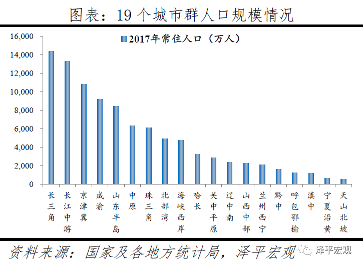

在都市圈层面， 24个1000万人以上的大都市圈以6.7%的土地集聚33%的人口创造约54%的GDP，其中上海、北京、深莞惠、广佛肇等都市圈发展潜力明显居前。鉴于当前多数城市群发育不成熟，且部分核心城市生产要素明显向周边溢出，中央把以大城市为核心的都市圈作为城市群建设的突破口和抓手。2019年2月，国家发改委发布《关于培育发展现代化都市圈的指导意见》，这是中国第一份以“都市圈”为主题的中央文件,要求以大城市及周边地区同城化为方向推进基础设施一体化、强化城市间产业分工协作、加快建设统一开放市场、推进公共服务共建共享等，包括以轨道交通等为基础打造1小时通勤圈。根据有关城市群规划及相关地方规划，当前中国有上海、北京、广佛肇、杭州、深莞惠等10个2000万人以上的大都市圈，有重庆、青岛、厦泉漳等14个1000万-2000万人大都市圈。24个千万级大都市圈以全国6.7%的土地集聚约33%的常住人口，创造约54%的GDP。从发展潜力看，上海、北京、深莞惠、广佛肇都市圈居前，之后则是苏锡常、天津、南京、长株潭、杭州、重庆等都市圈。需要注意的是，部分都市圈范围有重合，比如上海都市圈与杭州都市圈、苏锡常都市圈均有重合。

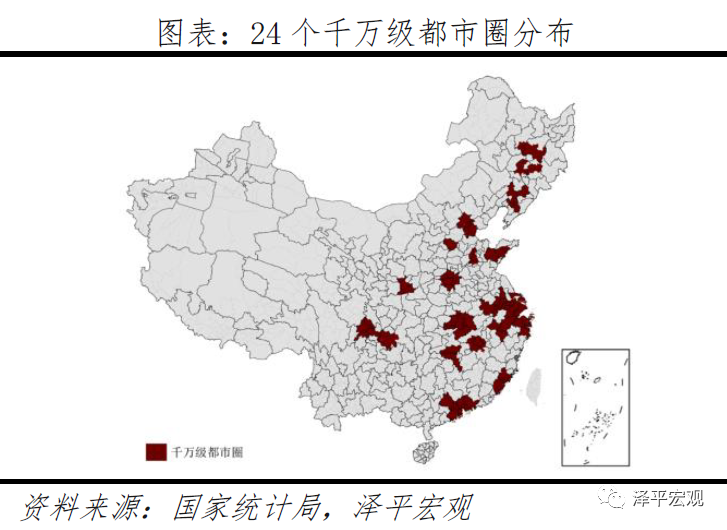

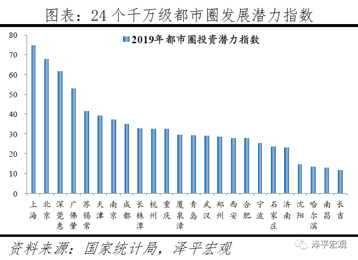

在24个大都市圈之外，仍有两类三四线城市值得关注:第一类是东部地区经济实力比较突出的三四线城市，多数位于城市群内，如温州、珠海、中山、徐州、海口、金华、唐山、泰州、保定、威海等。珠海、中山是珠江口西岸中心城市，珠中江都市圈2017年末人口达958.7万，有望成为下一个千万级大都市圈。温州、威海均为经济发达的沿海工贸城市；唐山、保定分别位于京津冀协同发展空间布局“三轴”中的“京唐秦”、“京保石”产业发展带上。该类城市中唯一不在19大城市群的是淮海经济区中心城市徐州。2018年国家发改委《淮河生态经济带发展规划》“北部淮海经济区”部分明确提出：“着力提升徐州区域中心城市辐射带动能力，发挥连云港新亚欧大陆桥经济走廊东方起点和陆海交汇枢纽作用，推动淮海经济区协同发展”，并界定了淮海经济区包括以徐州为核心的3省10市，面积8.9万平方公里。

第二类是距离中心大城市较远、辖区或腹地人口规模大的中西部地方性中心城市，如洛阳、包头、银川、鄂尔多斯、岳阳、绵阳、衡阳、安阳、广安、遂宁、柳州、南阳等，也多数位于城市群内。其中，银川为省会城市，洛阳、包头、鄂尔多斯、岳阳、衡阳、柳州、南阳分别为所在省份的省域副中心城市。此外，宜昌、常德、遵义、襄阳、赣州等地方性中心城市目前不在发展潜力百强城市之列，但从长远看仍具备一定发展潜质。