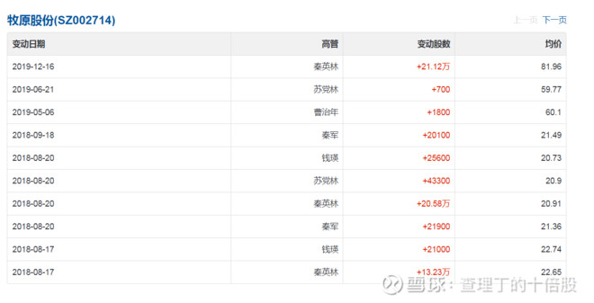
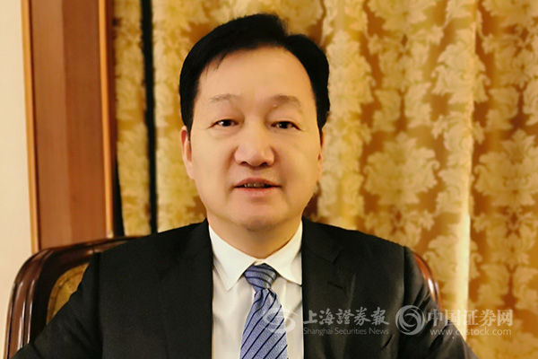

## 猪价和股价的交集

猪价是受猪周期的影响。很多人都拿猪周期类比其它周期性行业。开始也认为似乎差不多，都是周期性行业，所以按周期性行业投资应该没错。然而仔细分析，却发现猪周期有别于其它行业完全不同的特征：

1、猪是属于快速永续消费产品，前端的生产时间长，而后端的消化却很短。这和具有周期性质的行业不同，工业产品前端生产时间都很短，而后端消化却很长。

2、所以周期时间上也就完全不同。猪周期时间4～5年，高峰盈利期最多半年，低谷亏损期最多一年，其它时间都是享受盈利。如果以牧原为例，牧原最长亏损期都是半年，两个季度，而全年则未出现亏损。2014年、2018年。

相比其它行业周期，当高峰期过后，你根本无法知道下一个周期拐点在哪，或者时间跨度很长，十年甚至几十年，谁能等得起？

所以投资猪股的交集点，就是当牧原出季度预亏公告后买入就可以了。因为在此之前股价已经提前反映了猪价。最多后面还有一个季度亏损，然后就要反转了。三个月时间比起三年甚至更长可以忽略不计

## 为什么部署屠宰

公司早些年对于屠宰业务持比较谨慎态度，但今年春节之后开始大力布局屠宰业务，公司大力发展屠宰业务是基于对屠宰业务的信心还是仅仅因为政策的改变？
一是政策差别，先前由于非洲猪瘟农业农村部实施划大区管理，并且未来以运肉为主。原来中国的屠宰产能分布以销区为主，在产区优质的屠宰稀缺，存在市场需求。当时环境与现在的政策环境存在差异，屠宰业务确实已经展现出了不一样的战略地位与盈利前景。二是，牧原对于现在开展屠宰业务持有信心，我们的屠宰场建在已经有大量产能的区域，可以消化自己生产的生猪。并且我们在屠宰场的设计建造，选材，内部的工艺优化，成本节约都做了大量工作。我们相信这些屠宰场运营之后能获得不错的成绩。

## 运猪和运肉的成本区别

冷鲜肉运输半径？
A：1200公里以内是完全没问题的。
Q33：将猪卖到上海屠宰再上市跟将屠宰好的冷鲜肉卖到上海，这两者的成本差。
A：成本差主要在损耗，猪肉水分含量70%多，一头猪24小时放在猪圈不活动体重会下降4.5公斤，并在猪在运输过程中会应激会死亡，这是拉猪和拉肉最大的成本比较。冷鲜品水分的增发和运输途中死亡，拉猪没有明显的成本优势。我们屠宰的优势在于我们围绕养殖端布局，我们拉猪半径基本控制在100公里以内，头均损耗控制在1.0以内。一公斤毛猪现在30多块钱，差3公斤数据很大，围绕养殖端布局运输成本和头均损耗、猪运输过程中的死亡，简单算下来有几十块钱的成本优势。

## 牧原股份 检查清单

来自[赔率优先的雪球原创专栏](https://xueqiu.com/2001790578/column)

### 1、业务是否简单易懂？（如果一家公司的财报你看不懂，说明公司不想让你看懂。--巴菲特）

生猪的养殖与销售

### 2、是否有竞争优势？

低成本，地理位置，技术，资金等等优势

### 3、Avoid dealing with people of questionable character避免和道德品质有问题的人交易（芒格）

是否有利益输送？

是否忽视小股东利益？

秦英林是个好同志。从牧原的文化宣传来开，强调奉献、强调务实，应该是个好公司。

### 4、现金流 利润容易造价调节 企业是一个从现金开始到现金结束的游戏

现金流优秀

### 5、小心多元化 特别是和主业无关的多元化（如果主业非常好，很有潜力，谁会去搞副业呢）

专注养猪30年

### 6、周期股 周期性很难看懂，别给自己找麻烦

是周期股，但是随着集中度提升周期会越来越不明显。极端情况，中国只有一家养猪场，还会有周期吗？

### 7、企业在国家的重要性，国家的比较优势（比如美国的消费医药很强 中国的白酒房地产制造业强）

中国人爱吃猪肉，我本人也是，有些菜必须用猪肉，红烧肉炸猪排

### 8、被替代的需求不能买 例如柯达 （卖空柯达 诺基亚赚钱？）（新的技术出来谁是赢家不知道，但输家是一定能知道的）

猪的需求目前看不会被替代

### 9、行业集中度 或者细分市场的龙头 或者未来成为龙头

已经是市值第一的养猪企业了

### 10、行业空间有没有十倍空间？

2019年1000万头猪，中国一年消费7亿头猪，理论上有70倍空间，实际上不太可能。

目前看，中国还是散户养猪为主，在牧原面前毫无竞争力，随着时间一定会慢慢被淘汰。

### 11、公司的高层愿意增持或者回购股份(作秀的另当别论)

和董明珠一样，无论多少都在增持

### 12、如果买完股票 交易所关门10年 是否还会买？一旦购进优良公司的股票，最佳的决策就是按兵不动

会的

### 13、营收 利润 现金流 都可以造假 唯有分红是真的。其实巴菲特的核心就是分红投资，只有分红是可以掌控的，其他都不能掌控（知乎大神）

分红还算慷慨，增发也都去造猪舍了，看看猪的增量就知道了。

### 14、品牌价值《财务报表分析》黄世忠 263页 可以百度品牌价值

正在推进牧原肉食C端品牌，还和物美有过合作，不过只是卖肉，没有打品牌。

### 15、为什么只买短产业链公司 产业链越长出错的可能性就越大

饲料自己的，自己屠宰

## 16、买单一产品和简单工艺企业，就像茅台一样，不需要资本投入到新产品研发

产品单一，工艺简单，养猪技术领先行业

## 17、有更好的机会吗 对比下茅台格力？你觉得哪个好？机会成本

茅台估值过高了，格力回调考虑买入

## 18、公司的产品或者服务 我自己会买吗

会

## 19、Don’t "fall in love" with an investment不要在投资方面“陷入爱河”（芒格）

仓位20%，五分钟就能看出是好生意。账还是要算清楚的。

## 20、小心应收账款持续增加，预收款越多越好

应收账款不多，预收款也不多

## 21、小心高商誉

没有商誉

## 22、小心高负债企业，特别是负债利率高的

账上现金可以覆盖债务

## 23、不买股息率低于2%的企业

2020利润保守估计300亿，分红率20%，分红60亿。目前市值2520亿，股息率2.4%

这一条不一定吧，因为伯克希尔也不分红，主要看赚的钱拿去干嘛了，如果不分红还是能维持高ROE，那没必要分红。

## 24、德才兼备的管理，董事长面相不好的不买

秦英林1965 (age 55 years）生人，是个好同志，非常专注敬业.。这次武汉捐了两亿。想到了董明珠，也捐了一亿。

### 25、公司是否具有反脆弱性

养猪还是比较脆弱的，但是遇到非瘟，大公司反而获利了。

只要低成本优势在，什么消息都是利好牧原。

### 26、寻找三条看空理由或者风险点，真正的风险来自于你没有想到的风险。

猪肉价格下跌

食品安全问题

非瘟

### 27、你会打心底里渴望股票在这个价位上再跌 30% 吗？

希望

### 28、安全边际。给公司估值，然后半价买入

保守估计2020利润300亿，目前市值不足10PE

### 29、赚钱的确定性，100%赚钱（林园）

猪肉消费是比较确定的，供应来看现在非常缺猪。

### 30、投资一个公司前,最少我要跟踪三年。然后我会少量地买入，然后再继续跟踪，觉得没有问题，大量地买入，然后再跟踪（林园）

检查清单的目的就是排雷

### 31、从表象上看，“小投入，大产出” 的公司才是赚钱机器，公司的盈利不是靠增加投资来产出的。我们做生意也是这样，比如开餐厅，我投资一百万，希望它赚一个亿，而不是赚一个亿需要投资两个亿来获取。投资一定，产出无限大，这是我们钟爱的公司。（林园）

牧原确实是个重资产公司，投资很大。目前看2020一年的利润就可以收回投资了。

### 32、有千年文化的、竞争中胜出的、没有竞争对手的垄断企业 三类公司最容易赚钱（林园）

牧原是竞争中胜出的公司

### 33、我们买股票也是在做实业，我投资者，就是在高增长期给你投资一把。等你过了高增长期，我就退出来。我们追求最大的利润，我再去投资别的高增长期。我的理解，股市为什么是一个最好的平台，我把它卖掉，我又不用变成钱，我可以买第二个。实际上是买第二个行业或者企业的高增长期，我一定比别人快。实业是做不到这点的（林园）

目前看，牧原还在一个高速增长期，未来三年猪数量增长50%以上。

### 34、零库存，是我们选择投资这些公司的一个标准。它没有库存，你要买它的产品，先打预付款，靠赊款的这种公司，我一般不会选择（体现在财报中的应收账款越少越好，预收账款越多越好）。你我买的产品，先打预付款，我买的公司基本都是这种性质。比如说黄山、高速公路，你不交钱他不让你过，就符合这个概念

猪一般养肥了就会卖掉

### 35、买点的选择是我们不能选择的，高低我也是不知道的。比如你20元买招商银行，到底高不高我不知道。我认为，好的公司，你如果买高了，这段时间可能相对有一定的泡沫。但是随着好的公司的业绩的增长，我认为这个泡沫会被挤掉。每年的估值，一般是在四到八月之间大家会重新的估值。好的公司，大家给它重新估值，一定会把这个泡沫挤掉。股票市场能够看明年，看第二年的，又重新的估值。只是我算的比较宽一点，给这个企业算了三年的帐。我就是一个投资人，未来企业三年的盈利能够算到的，我会重仓持有，算不到的我不会投入。如果算不到的，你再说好，我都不会投入

保守算

2020年 2000万头猪 一头猪赚1500 利润300亿

2021年3000万头猪 一头猪赚1000 利润300亿

2022年4000万头猪 一头猪赚500 利润200亿

### 36、接着谈谈我对股票市场风险的认识。我没有说我哪天的钱是闲的，我要不断的赚钱。我帐户有的市值突破2亿了，我的帐上可能只有几百元。就是不能再买股票了。我一直是满仓，也没有空仓过。因为今天高了，我退出来点炒波段，我做不到。我说我就是傻子，我今天这个钱不给我赚钱，我就不舒服。因为我没有失败过，我就觉得没有风险。我觉得这个市场没有风险，我觉得做别的，开餐厅，做实业风险大得很。跟着我的人，八个月以后，风险意识还淡薄 林园

满仓

### 37、计算最差的情况

最差的情况三年后5000万头猪，一头只赚300块，150亿利润，按照目前市值16PE

### 38、垄断 定价权

没有垄断，定价权没有。低成本可以在别人不赚钱的时候还能盈利。

### 39、如果行业没有变差，一家好公司要变差的概率比较低，行业的景气度是我们投资的首选。

未来两年，养猪致富还是确定的

### 40、股东人数越少，则代表筹码越集中，股价越有可能上涨。筹码的集中度偏高,有大机构驻守其中。

股权集中度高

股东人数下降

流通市值少
总市值：2435.21亿
流通值：1289.06亿

### 41、同样的东西在不同的市场，也会有不同的估值待遇，比如同时在中国和新加坡上市的中新药业，PE就存在很大的差距，这是因为两个市场的需求和流动性完全不同。这种情况，就好比一盘青菜，在黄山脚下的饭店可能就只卖到10-20元，而到了黄山上的宾馆，就要卖到50了，如果你在山上以30元的价格买到，那就说明你是低于价值买进，而如果是在山下花30元吃一盘青菜，就属于高于价值买入。

A股定价是真的高

### 42、“选美理论”是凯恩斯（John Maynard Keynes）在研究不确定性时提出的，他总结了自己在金融市场投资的诀窍时，以形象化的语言描述了他的投资理论，那就是金融投资如同选美。在有众多美女参加的选美比赛中，如果猜中了谁能够得冠军，你就可以得到大奖。你应该怎么猜？凯恩斯先生告诉你，别猜你认为最漂亮的美女能够拿冠军，而应该猜大家会选哪个美女做冠军。即便那个女孩丑得像时下经常出入各类搞笑场合的娱乐明星，只要大家都投她的票，你就应该选她而不能选那个长得像你梦中情人的美女。这诀窍就是要猜准大家的选美倾向和投票行为。再回到金融市场投资问题上，不论是炒股票、炒期货，还是买基金、买债券，不要去买自己认为能够赚钱的金融品种，而是要买大家普遍认为能够赚钱的品种，哪怕那个品种根本不值钱，这道理同猜中选美冠军就能够得奖是一模一样的。

有点像李笑来说的：“傻子的共识也是共识”

猪肉涨价这个人人都知道，所以猪肉企业赚钱已经是共识了

### 43、两种买法，第一种是成长股，未来三年每年超过18%的利润增长。第二种，买低估的，买他的资产，一般12个月之内会反转。

超过18%是必然的

### 44、低估不能成为买股的理由

多么痛的领悟

10086、只要有原则性问题就排除不买，说不大师芒格，好企业是极其稀少的，我只要三家好公司足以

### 主要问题

#### 14、品牌价值《财务报表分析》黄世忠 263页 可以百度品牌价值

品牌价值目前不高，未来打造牧原牌的猪

#### 38、垄断 定价权

没有垄断，定价权没有。低成本可以在别人不赚钱的时候还能盈利。

说白了还是养猪这个行业没有品牌，产品同质化导致没有定价权。所以谁的成本低，谁就有优势。

### 最后看估值

唯一靠谱的估值方法自由现金流折现。

我之前算过，直接复制过来了。

2020利润保守估计300亿，2021年，利润保守估计200亿，保守折现到今天400亿。

从2022年开始用自由现金流折现计算内在价值。

养猪的数量5年10%增长，到时差不多一亿头猪。猪肉价格按照最保守的计算方法，散户的成本价计算，牧原比散户的成本价低5元/KG,一头猪120KG就是赚600元一头，保守计算赚500一头。2022年，一年养4000万头猪，利润就是200亿。

五到三十年，利润增长按照2%的通货膨胀计算，养猪数量不再增加。

三十年后利润忽略不计。

无风险利率按照十年期国债两倍计算，十年期国债利率不到3%，保守按照6%计算。

内在价值5000亿左右，这个是两年后的内在价值，考虑到牧原有负债和带毛的不算因素，打8折计算。折现到现在4000亿左右。

再加上20年21年两年的折现利润400亿，目前[牧原股份](https://xueqiu.com/S/SZ002714?from=status_stock_match)的保守内在价值4400亿左右。

保守的地方在于，猪肉价格按照散户成本价计算，牧原一亿头之后不增长，不开展新业务，无风险利率按照国债两倍多计算，未来两年利润计算非常保守，三十年后的利润不算。

**再按照50%安全边际买入，2200亿市值以内买入。**

## 后续跟踪

### 2021年一季报

财务报表没有问题也应该清仓走人了。假如牧原股份2018年的财报没有问题，2018年牧原几乎没有盈利。2020公司利润这么高是可以做到的，在猪肉价格15元左右的年份里做到了没亏损，2020年猪肉平均价格35元利润就可想而知了利润率200%多。销售550亿，成本235亿，利润315亿（按2018年成本计算），由此可算猪出栏量2018年1100万，今年235可得1929万，和1811万出入100多万，我想应该成本增加了，而且我算的出来的数据只是大概。股东利润这块我想应该是和别人一起开了很多猪场，不是完全控股。如果今年猪肉平均价格到了25元，猪出栏量没有太大变化，今年利润也就剩100多亿了，猪周期对公司的盈利影响很大的。就算是不质疑财务造假，大家也应该清仓走人了，这个猪周期刚开始从顶峰开始往下走。猪周期，最高一斤40元到现在26元，今年年底我想到20元也有可能，公司利润不到100亿我想就没人质疑财务造假了。猪周期的心理变化，养猪的赚钱了，大家一窝蜂的开始养猪，产能过剩，猪肉价格下降，降到成本线以下，都不养猪，价格开始📈，这好多东西都可以应用到这个上面，蒜你狠以及各种水果蔬菜也是由此而来，你可以想想有时某年一样东西特别贵，第二年价格直线下降。哪个公司能做到在别人亏损时，他不亏损而是选择扩张，利润大涨时开始控制规模和成本，这就是一个好公司，牧原要是能控制成本和规模，三年后再见。

## 参考资料

https://xueqiu.com/8418018079/159379062

https://zhuanlan.zhihu.com/p/141997910

https://card.weibo.com/article/m/show/id/2309404510917730631744?_wb_client_=1

https://xueqiu.com/2001790578/145464258