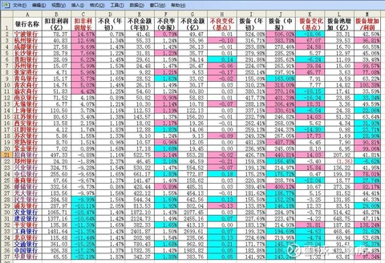

银行股中报出来后，研究银行的帖子是多如牛毛，但往往都是对自己持仓爱股进行论证多优秀，隐藏了多少利润，而对其他银行股要么不闻不问，要么踩上几脚。缺少对所有银行股的跟踪，缺少对整个行业的把握。我们持有银行股，一定要了解当前整个银行所处的环境，大环境好，自然自己优秀的银行股取得更好的收益当然更好；大环境不好，自己的银行再多优秀也很难独善其身。通过这个表格进行横向比较，可以知道自己所持的爱股在行业里的大概位置。

对于这个表格先做个说明，所有数据都是根据中报进行提取，表格中对部分指标进行了排序，每一列**粉红色**表示这个指标排名前十；每一列**青绿**色表示这项指标排名后十位。本表格没有对当季核销坏账金额进行比较（因为财务指标没有直接的，需要去算，太花时间了）。**本表格没有对个股估值（市盈率）进行比较**，因此个股值不值得投资，是估值优先还是成长优先，各人根据自己的投资风格来判断。大家都说自己的银行处理坏账力度大，隐藏了利润，这个表格有助于看究竟谁力度大谁力度小。最重要的是可以看出哪个银行确实可以抵御今年特殊的困难情况，哪些还在苦苦挣扎。

话不多说，我的EXCEL表格截图如下：

这个表格信息量比较大，通过比较能得到很多信息，下面我把我的理解跟大家解读一下，也欢迎有新的体会的球友把你的体会留言分享。

**1、扣非利润增长情况**

**成长性的关键就是看增长，从这个指标看[宁波银行](https://xueqiu.com/S/SZ002142?from=status_stock_match)[杭州银行](https://xueqiu.com/S/SH600926?from=status_stock_match)[成都银行](https://xueqiu.com/S/SH601838?from=status_stock_match)都不错**，如果这个都不增长了那就没有任何意义，更不要说实际上我的增长是多少。有人说这次正增长的银行股不讲zz，没有大力处理可能的坏账，这有点拍脑袋，后面几项数据可以很好地看出来处理力度大不大。

**2、不良率**

**不良率反应的是这个银行历史包袱处理情况以及资产质量情况，比较低的有[宁波银行](https://xueqiu.com/S/SZ002142?from=status_stock_match)[邮储银行](https://xueqiu.com/S/01658?from=status_stock_match)[南京银行](https://xueqiu.com/S/SH601009?from=status_stock_match)等，高的有[郑州银行](https://xueqiu.com/S/SZ002936?from=status_stock_match)南京银行[华夏银行](https://xueqiu.com/S/SH600015?from=status_stock_match)等，**不良率低的说明历史包袱处理得很好，包袱不重，并且新生不良也不高，资产质量较好。但这是个**静态指标**，表示的是之前的情况，还需要对这个指标都动态情况连续比较，如果这个指标一直在下降，表示越来越好了；反之，则表示资产质量变差，坏账比例越来越高。**因此，好坏还需要把几个季度的数据连起来看。**比如说[杭州银行](https://xueqiu.com/S/SH600926?from=status_stock_match)的不良率一直在快速下降，说明历史遗留问题越来越小了，资产质量越来越高了。

**3、不良率变化**

**这个指标非常关键，众所周知，今年受疫情影响，银行坏账肯定是要上升的，只要这个是负的、甚至正的但比较小，我觉得都是说明这个银行大力进行了不良的认定，并且大力进行了核销处理。**可以看出，[郑州银行](https://xueqiu.com/S/SZ002936?from=status_stock_match)[张家港行](https://xueqiu.com/S/SZ002839?from=status_stock_match)[浦发银行](https://xueqiu.com/S/SH600000?from=status_stock_match)等处理力度较大，[交通银行](https://xueqiu.com/S/SH601328?from=status_stock_match)[中信银行](https://xueqiu.com/S/SH601998?from=status_stock_match)较小，还需要结合拨备变化情况来看。

**4、拨备覆盖率**

**这个大家都知道越高越好，越高表示留了更多的资金应对不良贷款将来变成真正的坏账，体现出银行风险应对能力。**比较高的有[宁波银行](https://xueqiu.com/S/SZ002142?from=status_stock_match)[常熟银行](https://xueqiu.com/S/SH601128?from=status_stock_match)[招商银行](https://xueqiu.com/S/SH600036?from=status_stock_match)等，比较低的有[华夏银行](https://xueqiu.com/S/SH600015?from=status_stock_match)[浦发银行](https://xueqiu.com/S/SH600000?from=status_stock_match)[民生银行](https://xueqiu.com/S/SH600016?from=status_stock_match)等。但**这也是个静态指标**，需要长期看一个银行的拨备覆盖率是在不断上升还是原地踏步甚至下降。长期上升，说明这个银行实际赚钱能力强，每次都隐藏部分利润到拨备池里，免得业绩增长太快引人注目，也不利于将来长远的发展。

**5、拨备覆盖率变化情况**

**这个意义前面已经说过，也反映出这个银行处理力度大不大。可以看出，[杭州银行](https://xueqiu.com/S/SH600926?from=status_stock_match)[张家港行](https://xueqiu.com/S/SZ002839?from=status_stock_match)[苏州银行](https://xueqiu.com/S/SZ002966?from=status_stock_match)等拨备增加力度非常大。**拨备增加较小的有[交通银行](https://xueqiu.com/S/SH601328?from=status_stock_match)[宁波银行](https://xueqiu.com/S/SZ002142?from=status_stock_match)[南京银行](https://xueqiu.com/S/SH601009?from=status_stock_match)等，这里需要说明一下，**并非拨备上升的就没有处理，有的是拨备覆盖率太高了，每增加1亿不良，需要增加数亿利润进来，才能保持拨备不变。**比如说宁波银行拨备下降，但实际上宁波银行今年也拿出来33.31亿放到拨备池里来。**有的是确实没啥利润可以挪过来，只能拿出少量利润进来，但抵不住不良增加从而引起拨备下降。**

**6、拨备池金额增加数据/上半年扣非利润**

这个跟前面几个联合起来看就有意思了，**可以看出哪些银行优秀哪些银行一般**了。不用说，如果放到拨备池里的利润跟当季利润比值很大，说明处理力度很大，拿出来相当多的利润来应对将来的不良。比如说[平安银行](https://xueqiu.com/S/SZ000001?from=status_stock_match)[青农商行](https://xueqiu.com/S/SZ002958?from=status_stock_match)[苏州银行](https://xueqiu.com/S/SZ002966?from=status_stock_match)等今年放到拨备的金额几乎与利润相当，说明力度很大。但是，不能为拨备而拨备，既然赚了很多钱，完全应该确保利润增长的情况下再把多余的放拨备里来吧。**优秀的银行完全可以在利润正增长的情况下，还把大把的利润藏在拨备里去，确保拨备覆盖新生不良的情况下还能大幅提高拨备！！！**

**7、其他还有很多可以挖掘的地方，比如说几个大行的情况；大行、股份行、城商行横向比较情况；不同区域经济跟当地银行质量等等。**

总之不同的人通过这个表格可以得到不同的结论，根据自己的风格找到符合自己的银行股

## 参考资料

https://xueqiu.com/3260327054/158098489