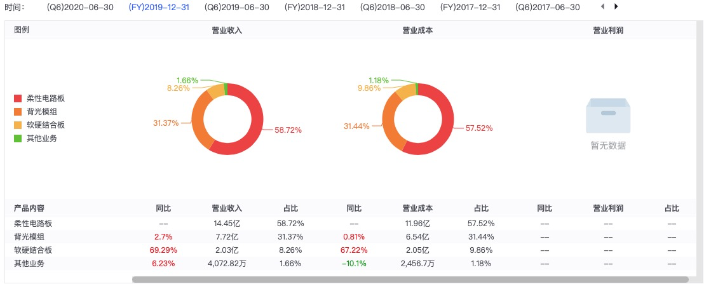

## 概貌

FPC的国内龙头

### 主营业务

挠性印制电路板（FPC）的研发、制造和销售

### 产品及用途

应用于液晶显示模组、指纹识别模组、触控模组

**行业地位**

国内行业前三，行业第一位东山精密

**竞争对手**

国外：日本旗胜、日本住友电工、日本藤仓、美国M-FIFX、日东电工、韩国永丰、韩国世一

国内：精诚达、元盛电子、三德冠、[景旺电子](https://xueqiu.com/S/SH603228?from=status_stock_match)、上达电子、[东山精密](https://xueqiu.com/S/SZ002384?from=status_stock_match)、台湾臻鼎、嘉联益、毅嘉、Inter-Flex

**简评**

**挠性印制电路板全球竞争环境非常充分，且以日韩企业为主，国内厂家整体实力仍然较弱，未来最大的的看点在于国产化替代，好在国内手机厂商迅速崛起，国内终端需求提升，国产化才有意义**

## FPC

手机FPC厂的FPC（挠性电路板）是PCB的一种，又被称为“软板”。FPC 以聚酰亚胺或聚酯薄膜等柔性基材制成，具有配线密度高、重量轻、厚度薄、可弯曲、灵活度高等优点，能承受数百万次的动态弯曲而不损坏导线，具有其他类型电路板无法比拟的优势。

## 什么是PCB

PCB（Printed Circuit Board），中文名称为印制[线路板](https://link.zhihu.com/?target=http%3A//www.china-fpc.com/ProductMain.html)，简称印制板，是电子工业的重要部件之一。几乎每种电子设备，小到电子手表、计算器，大到计算机，通讯电子设备，军用武器系统，只要有集成电路等电子元器件，为了它们之间的电气互连，都要使用印制板。在较大型的电子产品研究过程中，最基本的成功因素是该产品的印制板的设计、文件编制和制造。印制板的设计和制造质量直接影响到整个产品的质量和成本，甚至导致商业竞争的成败。

**PCB的作用**

PCB的作用电子设备采用印制板后，由于同类印制板的一致性，从而避免了人工接线的差错，并可实现电子元器件自动插装或贴装、自动焊锡、自动检测，保证了电子设备的质量，提高了劳动生产率、降低了成本，并便于维修。

**PCB的发展**

印制板从单层发展到双面、多层和挠性，并且仍旧保持着各自的发展趋势。由于不断地向高精度、高密度和高可靠性方向发展，不断缩小体积、减少成本、提高性能，使得印制板在未来电子设备的发展工程中，仍然保持着强大的生命力。

综述国内外对未来印制板生产制造技术发展动向的论述基本是一致的，即向高密度，高精度，细孔径，细导线，细间距，高可靠，多层化，高速传输，轻量，薄型方向发展，在生产上同时向提高生产率，降低成本，减少污染，适应多品种、小批量生产方向发展。印制电路的技术发展水平，一般以印制板上的线宽，孔径，板厚/孔径比值为代表。

## 市场格局

FPC作为消费电子产品的配套产品，电子产品的市场变化直接影响FPC产品的产销量，公司的下游客户联想、天马、京东方、欧菲光等国内厂商的经营状况决定了FPC的产量变化。近年来，电子产品需求量持续爆发，联想、小米、魅族等企业异军突起，造成了国内外供应商同台竞争。

但由于国外FPC企业起步早、资金雄厚，所以生产规模、技术水平等多方面具有较强竞争优势。日本NOK2013年营收规模在150亿人民币左右，而弘信电子作为国内厂商第一名，2013年营业收入仅为6.7亿元。

随着国外企业进入国内市场以及部分内资企业进入FPC产业，数量众多的投资者将造成市场竞争加剧，甚至出现恶性竞争的局面。如果公司自身技术研发、生产不能一直保持领先优势，公司的业务毛利率将面临下降风险。

## 参考文档

https://zhuanlan.zhihu.com/p/65032894