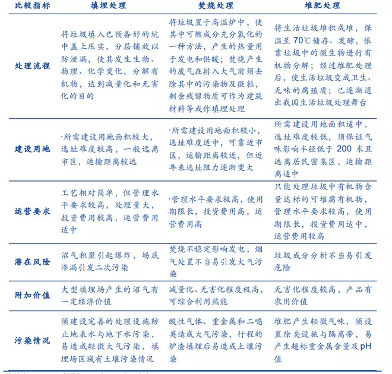
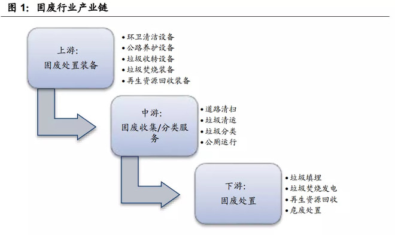

## https://www.jujiaohuanbao.com/detail-7624.html

### 摘要

#### 竞争格局

光大国际作为国内垃圾发电的绝对龙头企业，拿单到手软，中标金额为113.5亿，占比约28%。据不完全统计，光大国际(包括光大绿色环保)拿下16个项目，主要集中在安徽、河北、山东、广东四个省份，光大国际牢牢把握住了发展机遇，积极开发和扩张垃圾焚烧发电市场。城发环境在2019年度共计中标10个项目，总中标金额为53.17亿，占比13%，项目所在地均为安徽。康恒环境总计中标9个项目，遍布安徽、河北、山东、江苏等7个省份，垃圾焚烧发电业务多地开花，中标金额高达48.85亿，占比12%。

##### 市场规模

根据对光大国际、海螺创业、上海环境、伟明环保、绿色动力等12家垃圾发电上市公司运营项目投资额的测算，得到2016-2019年垃圾发电项目单位投资成本由54万元/(吨/日)提高至55万元/(吨/日)，假设2020年单位投资成本小幅提升至56万元/(吨/日);考虑典型的垃圾发电项目投资结构，工程土建、工程安装、设备以及其他分别占比25%、13%、38%、24%，同时假设垃圾焚烧发电项目建设周期为18个月，T年投运的项目在T-2/T-1/T年的建设期分别为2.5/10/5.5个月，则2026-2021年间垃圾发电总工程及设备市场规模分别达到1229亿元和814亿元。

##### 发展趋势

经过前期的市场激烈竞争，目前垃圾焚烧发电市场竞争格局已经成型，行业跑马圈地阶段基本告一段落。目前行业内中小企业弯道超车概率大幅降低，新参与者进入市场的参与兴趣明显下降，市场在向龙头集中，行业竞争强度明显下降，低价中标抢市场现象近两年已较为罕见。随着人均生活垃圾产量的增长和生活垃圾焚烧比例的提升，垃圾焚烧市场近几年快速发展，同时对垃圾焚烧企业的环境表现要求不断提高，竞争格局呈现出强者恒强的特征。

2. ## https://xueqiu.com/1643044849/163330383

国内生活垃圾主要有填埋、焚烧与堆肥三种主要处理方式，目前主导的生活垃圾处理方式为填埋处理，国家希望未来大力发展的是焚烧处理

### 产业链

### 美国情况

通过多年的发展， 美国的固废市场化成熟，市场化率高达 80%， 三大环卫龙头市占率合计高达 44%

### 国内未来还有很大的增长空间

美国的人均垃圾清运量是我们的三倍，美国的垃圾清运量 2000年左右达到顶峰，之后由于回收比例的提升和人们环保意识的增长，人均垃圾量有所下降。2014 年美国人产生约 2.58 亿吨固体废弃物， 人均产生 4.5 磅/天左右的固体废弃物。

从 1979 年开始，我国城镇垃圾清运量以每年 5.7%的增速快速增长了近 40 年，目前差不多人均清运垃圾量是美国的三分之一。

这就使得国内固废处理企业，至少有两个增长点，第一个就是传统粗放填埋市场向综合固废焚烧处理转变，第二个未来很长一段时间我们人均垃圾清运量还有增长空间

## http://www.cfej.net/jizhe/cmlw/202010/t20201023_804602.shtml

　从企业性质看，在50强企业中，国企26家，混合制企业8家，民企16家。国企国资在行业头部领域的占比已经高达80%，情况与去年相同，国企国资已成为行业企业增长的核心引擎。
　　据了解，当前环保产业总体发展向好，发展规模逐步壮大，技术水平显著提升，服务模式不断创新，2019年全国环保产业营业收入约1.78万亿元，同比增长11.3%，远高于同期的GDP增长速度。

## https://xueqiu.com/3093244593/161562962

生态环境部今年设立了生活垃圾焚烧发电厂自动监测数据公开平台，企业必须将焚烧项目所在详细地址、每台炉的炉型、每台炉设计处理量、每台炉投入运行的起始时间、设计发电量等信息，上报给各地生态环境局，再上传到环境部平台。

- [ ] TODO 以后会找时间把数据报表做出来

