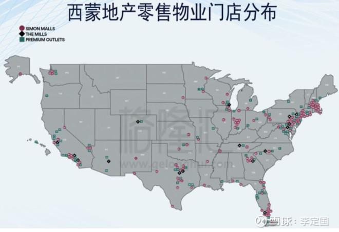
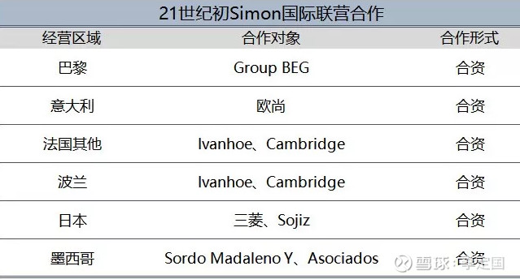

## 西蒙地产

[西蒙地产](https://xueqiu.com/S/SPG?from=status_stock_match)集团（西蒙PropertyGroup，纽约证券交易所代码“SPG”），是全美最大的商业地产运营商和北美最大的零售地产上市公司，标准[普尔](https://xueqiu.com/S/POOL?from=status_stock_match)500指数成分股之一，拥有世界公开发售的最大的商业地产REITs。最高峰是市值超过700亿美元，超过美国前五大零售地产公司中另外四家公司的总和。

西蒙在美国商业地产领域地位怎样？一位分析师曾戏言：在中国，你也许去过[大悦城](https://xueqiu.com/S/SZ000031?from=status_stock_match)，知道万象城，逛过华润万家，在万达广场看过电影。而在美国，如果你shopping过，那你一定去过西蒙。

**在购物中心行业里，西蒙地产是标准的贵族阶级**，拥有总计232个零售物业，可租赁面积超过1.9亿平尺（2100万平米），西蒙的零售地产业态主要包括106个地区性购物中心（Regional Malls）、69个奥特莱斯名品折扣（Premium Outlets）、14大都会区购物中心（The Mills）以及4个社区生活中心（Community/Lifestyle Centers）。区域性购物中心通常包含至少一个传统的百货商店或大型零售商主力店与各种各样的小商店的组合，额外的商店通常位于停车场的周边，已共拥有13200多家已入驻店铺，其中主力店500多家，以国内或国际零售商为主。公司的106个区域性购物中心一般都是闭合的中心，可出租面积（GLA）在26万平方英尺到270万平方英尺之间。名品直销折扣购物中心通常是露天的商业中心，包含众多的设计师和制造商品牌店、工厂直销和折扣店等,并且一般位于大城市或旅游目的地附近。公司的69家名品直销折扣购物中心的可出租面积（GLA）在15万平方英尺到90万平方英尺之间。大都会购物中心分布在主要的大都市地区，结合了传统的购物中心、批发中心、大型零售商和娱乐设施等。公司的14处大都会购物中心的可出租面积（GLA）一般在120万平方英尺到230万平方英尺之间。公司的4个社区生活中心的可出租面积（GLA）从16万平方英尺到90万平方英尺不等。此外，[西蒙地产](https://xueqiu.com/S/SPG?from=status_stock_match)持有Klepierre公司约21.0%的股份；西蒙在欧洲、日本，韩国，马来西亚，墨西哥等国海外总计持有29家物业。

西蒙的收入来源则包括最低租金、超额租金、租户补偿及管理费用四个主要方面。2019年每尺平均销售额（坪效）达到$693，同比增长4.8％，2019年租户销售额超过600亿美元。在美国坪效排名前10的商场中西蒙独占五家，其中包括坪效超过1600美金的拉斯维加斯凯撒之宫豪华购物中心。

**西蒙地产：当之无愧的商业地产的并购之王**

西蒙在美国商业地产的并购地位可能比融创之于[中国地产](https://xueqiu.com/S/01838?from=status_stock_match)还更高。成立几十年几乎每一年都有并购，累计并购超过百起。其中在90年代，西蒙非常精准的抓住了三次机会，发起三起里程碑式的并购行为：首先，1996年集团收购了DeBartoloRealty，这使得重组后的西蒙集团拥有美国7%的商业地产市场份额，成为北美最大的上市零售地产商。1997年，西蒙集团又收购了马塞诸瑟州一个私人商业信托TheRetailPropertytrust，使其资产又增加了10个购物中心和一个社区广场。1998年，西蒙与CorporatePropertyInvestors达成协议，这为西蒙集团增加了23个购物中心和4个写字楼。至此，西蒙不但成为全美最大的商业地产商，其拥有的商业地产总量甚至超过后四家主要商业地产公司的总和。这几起并购也使得西蒙公司在纽约，芝加哥，洛杉矶，波士顿等一些主要的大都会市场具有更强的竞争地位。由此，西蒙的行业内的领先地位正式确立。

进入21世纪后，2003年，西蒙在北美所持有的246处物业，71%为区域购物中心、27%为社区购物中心。势头正盛的outlets、mills（奥特莱斯、大都会购物中心），其均未涉足，资产组合相对单一。构建“第二增长曲线”，成了西蒙新任务卡。2004年，其盯上了切尔西地产公司（Chelsea Property Group）。彼时的切尔西，是美国奥特莱斯界最大网红。在纽约、洛杉矶、奥兰多、拉斯维加斯等旅游城市周边持有31处品牌折扣村，日本、墨西哥亦有布局。种种优势，皆合西蒙心意。后者终以52亿美元（包括债务）拿下切尔西，高调进军奥莱。以切尔西为基，西蒙组建了奥特莱斯业务部。2004年，其名牌折扣村的总量(37家),甚至超过了22年深耕奥特莱斯的Tanger(36家)。

随后的2007年、2009、2010年，西蒙分别收购了The mills、Prime Outlets Acquisition Corp、Prime。添上Mills（大都会中心）这一业态后，西蒙的零售版图再次扩容。截至2019年底，西蒙在美国本土有69处奥特莱斯物业，其中45处是收购而来，约占3046万平方英尺可租赁面积的64%。此外，其所有Mills物业，均为收购所得。持续的并购扩张，让西蒙旗下奥特莱斯的可出租面积急速攀升，随之而来的则是收入规模和经营利润的增长。

多元化扩充版图的同时，西蒙也开始迈出国际化步伐。1998年，西蒙收购了BEG集团，随之持有波兰3处、法国2处零售物业。同年，西蒙在欧洲的第一个购物中心波兰Krakow开业，开业时出租率达100%。此后，以合资为主、收购为辅，西蒙继续进军了欧洲及亚洲部分国家。以合资方式打开新市场，减少开发成本，降低风险。

2012年3月，西蒙以20亿美元收购欧洲上市公司Klepierre29%的股权。后者在欧洲13个国家拥有260购物中心，价值超过210亿美元。

**商业地产封神靠规模，更看运营**

**商业运营的四大关键是：募、投、管、退。**西蒙在这四个点可以说是做到了极致：

**商业地产投资周期长，现金回流慢，“募”决定融资渠道和成本**，是公司运营根基。西蒙通过reits基金高杠杆收购，负债久期长、融资成本低，利息覆盖倍数高。以2016年4月的一笔大额收购为例，公司收购拉斯维加斯一家奢侈品购物中心，总价值为11亿美元，权益占比50%。公司为这笔收购借入5.5亿美元的十年期抵押贷款，全部覆盖公司收购款，相当于公司没有为此笔收购投入自有资金。西蒙的资金主要来自外部融资、处置物业、卖出股票和基金单位的收益，其中外部融资所占比例超半数，最高时达80%。而外部融资又以无抵押贷款占比居高，2016-2018年占比均高于70%，财务灵活性高。尽管西蒙杠杆率较高，但负债期限长成本低，利息保障倍数高，公司财务状况健康，信用风险低。

**“投”决定项目区位，是公司盈利能力的基础。**[西蒙地产](https://xueqiu.com/S/SPG?from=status_stock_match)商业模式的第二大特点是长期持有核心区域的优质资产，公司从1960年成立至今的60年里，积淀的大量优质项目，这是其他商业地产短期无法超越的核心竞争力所在。三分之二的项目是2000年以前获取的，三分之一的项目是1990年之前获取的。早期获取的项目区位优势明显，对于谢谢存量物业，通常会进行二次改造，包括调整主力租户、引入新业态等来提升出租率，进而提高项目资产回报率，通常投资回报率在8%以上，并且项目区位优势保证物业出租率处于高位，过去几年整体出租率保持在95%以上。年报显示，2018年西蒙累计完成了30个项目的二次开发，总投资约6亿美元，投资回报率平均8%。而自成立以来，其对项目的再开发总投资额约达35亿美元。

**“管”决定物业运营水平，可增厚公司盈利能力。**产品线层次清晰，定位明确。[西蒙地产](https://xueqiu.com/S/SPG?from=status_stock_match)有三条产品线。一是位于近郊的区域购物中心。区域购物中心是西蒙独创的商业地产类型，以室内为主，特征是以一家或多家传统百货商店作为锚店（anchorstore），与商场签订10年期以上长期租约，商场给予较大的租金折扣，并以锚店带动周边小型商户及商场人气。区域购物中心面积在2万至2.5万平方米，是西蒙地产的主力业态，占美国项目大约一半左右。二是位于远郊的奥特莱斯品牌折扣店，该项目主要以露天为主，包含众多工厂折扣店和设计师品牌店，面积在1万至8万平方米，位置在城市远郊或旅游景区。三是位于城市核心区域的大都会购物中心。大都会购物中心是集购物中心、奥特莱斯、娱乐设施于一体的混合型商业地产，通常位于城市核心区域，体量较大，面积在11万至22万平方米。

除了产品线层次明晰、定位明确外，公司还注重维护上下游关系的维护。从上游看，和主力供应商签订长期租约形成长期战略合作的主力店达到500家。通过结构租金和供应商形成利益共同体。从下游来看，注重维护消费者关系，通过将西蒙品牌与高质量的零售环境紧密结合，西蒙在商家及消费者之间树立了高端的品牌形象。最终都体现在公司租金和坪效的稳步上涨。

“**退”反映公司筛选、整合资产的能力**，资产变现收益是现金流的重要来源之一。对不符合公司战略或失去竞争优势的资产及时剥离，公司每年保持出售一定的资产，获取相应的资产处置收益，出售资产每年对公司营业收入的贡献保持在5%~10%。定期剥离非核心资产、淘汰低效物业是西蒙稳定经营的又一关键。据其年报，2018年处置资产，西蒙就录得2.888亿美元的净收益，占当年总营收的5.1%。

通过以上内涵式增长，西蒙的物业出租率、每平方英尺销售额等经营指标稳步提升，租金坪效比处于健康水平。1996-2000年，西蒙的净利润增长257倍，而后2001-2010年这十年间，西蒙的净利润从1.48亿美元增长超600倍至10.21亿，平均年增长率达21.3%。依靠稳健的商业模式、品牌优势，提高商业地产回报率，稳准狠的大并购，并通过金融模式打造规模效益从而放大优势，就是西蒙封神的底层逻辑。

## 三季报电话会议

### 总体介绍

我们承受了COVID。我们经受了政府的关闭。我们抵御了联邦和州健康的匮乏，尤其是在[房地产](https://xueqiu.com/S/SZ160628?from=status_stock_match)税方面。我们经受了北加州大火，路易斯安那州和其他地方的飓风以及内乱的影响，我们对所产生的现金流感到满意，我要感谢我的同事们打破局面，一切都在好转。

晚上好，感谢您今天加入我们。我们本季度的业绩反映了租户重新开放和租金收取方面的持续进展。目前，我们所有的[美国零售物业](https://xueqiu.com/S/RPAI?from=status_stock_match)都已开业，在我们的投资组合中已开业和运营着近25,000名租户，并欢迎购物者进入今年延长的假日购物季。

我们在美国零售产品组合中的收藏品不断改善。截至11月6日，我们已收取了第三季度净建筑租金的85％。现在第二季度的收款率为72％，如果将计算的递延金额包括在内，第二季度的收款率将提高到78％。今晚发布的新闻稿中明确列出了收款百分比的详细信息。尽管我们在处理收款方面取得了重大进展，但与某些较大的国家级租户相比，我们仍然有一些未解决的金额，不幸的是，即使他们开放并运营，他们也拒绝支付合同租金。

让我谈谈我们的结果。第三季度报告的FFO为7.23亿美元，合每股2.05美元。我对本季度的强劲盈利能力以及第三季度产生的6亿美元现金流感到满意。但是，本季度我们的国内和国际业务受到了约1.10美元每股摊薄收益的负面影响，这主要是由于租赁收入的减少，包括COVID-19中断导致的销售基础租金或辅助物业收入，部分被成本每股0.23美元所抵消减少举措或每股摊薄净收益0.87美元，然后再从我们的国际业务中再扣除0.05美元。第三季度还包括我们的FFO，与2019年第三季度相比，每股FFO较低的直线租金和每股0.06美元的较低费用为0.06美元，诉讼费用和租赁结算收入减少0.01美元

### 并购情况

现在，让我谈谈品牌和零售投资。众所周知，Spark是我们与Authentic Brands Group的50/50合资企业，是出于破产而收购Brooks和Lucky Brand的公司。这两个品牌都是历史悠久且广受认可的品牌，全球总销售额超过15亿美元。我们以低价收购公司，我们相信我们可以增加EBITDA并取得可观的投资回报。这两个品牌都已集成到Spark平台中，我们对在如此短的时间内取得的进展感到非常满意。如您所知，我们最近与布鲁克菲尔德（Brookfield）合作，并已按照破产法第363条的规定，通过持续经营交易来收购JC Penney公司的运营，知识产权和某些房地产。

我们相信，在Penney品牌下，公司在COVID之前的销售额超过90亿美元。我们相信，我们可以使公司恢复销售增长并增加EBITDA。该公司拥有忠实的核心多元化和包容性成本基础，主要集中在中等至较高的理想类别。这个客户对社区和JC Penney都同样重要，对我们也很重要，我们希望随着时间的推移，我们将继续扩大这个客户，我们为能够为社区服务而感到自豪。

我们相信，有了我们在布鲁克菲尔德的支持，将激情，所有权，强化的财务纪律集中到运营上，我们将有机会获得可观的投资回报。作为其中的一部分，我们也期待我们的好伙伴；Authentic Brands集团将成为购买集团的投资者。同样重要的是，我们很高兴地说，在我们的国家有60,000个工作岗位，我们将继续尽自己的一份力量来支持当地社区的努力。

现在，资产负债表；截至第三季度末，我们的总流动资金超过97亿美元，其中包括82亿美元的可用信贷额度，15亿美元的借贷能力，总计97亿美元。提醒一下，这是净值6.23亿美元的未偿付的季度末商业票据。我们一直活跃在安全的债务市场上，并已解决了该年度所有剩余的贷款到期日，包括通过单一资产CMBS证券化为泽西花园的工厂进行了再融资，该债券的定价和计划在下周开始

### 关于疫情可能发发展

好吧，我们现在唯一的情况是在埃尔帕索（El Paso），那里一个封闭的购物中心被要求基本上关闭，这是最近发生的，发生在周末。同样，我认为封闭式购物中心受到不公正和不一致的待遇，但我们现在处理我们处理的事情。那是Craig唯一的一位，我们希望它将重新开放。听着，我认为消费者显然是谨慎的。

我们的季度销售额下降幅度仅为10％。因此，消费者开始回来。他们戴着口罩，根据我们的所有协议，我们–我们希望–这种趋势将持续下去，但是肯定没有保证。至于预测政府，州和地方行动，显然，前后矛盾的程度令人非常沮丧。它是一个州一个州，一个城市一个城市，一个县一个县。这是一个证明，并且经常在外观上–经常被忽略，这使得它能够像我们这样处理，而且我们已经做到了，当我要人们削减工资并且他们做到了时，我们就做到了。他们每天都上班。您已经看到了集合–集合的改进。

我认为我们基本上在采取所有正确的措施，但是–我们只能处理我们可以处理的事情。我没有–我不知道是否会采取进一步的限制措施，我们还没有看到任何证据表明我们的环境正在蔓延。显然，网点和室外中心的状况更好。但是，正如您所知，NOI拥有50％的投资组合。这就是为什么我认为您会按原样查看我们的业绩的原因，而如果您查看我们的财务状况，最重要的一项就是房地产税，什么时候地方政府会开始减轻零售房地产税，与配送仓库等相比。完全相反。我们为社区做的工作比其他财产类型要多，我希望在不久的将来，他们（这些社区）会意识到这一点

### 关于未来战略

听着，我想–正如您所知道的，尤其是我们坚信直销店业务，零售商和品牌越来越多地朝着直接面向消费者的方向发展。因此，我认为这很好地发挥了作用，显然，在我们生活的大部分时间中，COVID（[音频不清晰]）无疑仍然是户外环境的优势。所以，我喜欢我们在哪里。我认为，随着时间的流逝，我们的投资组合中的非核心资产将会流失，通常这些资产不会对我们的NOI或现金流量产生重大影响。因此，我有点像我们在哪里–我们可能会放弃更多物业。

我认为现在国际很有趣。我们已经增加了价值，那里的销售业务非常好。亚洲的直销业务强劲。因此，我们将要发展这一点，但我觉得有点像按地区，按产品类型以及按（当然，按国内还是国际）的多样性。因此，我们的国际成绩相当不错。他们虽然倒下了。我们开设了一些新物业，并进行了一些扩建。因此，很难看到这一点，但是核心数量有所下降，但是他们恢复了相当强劲的势头。显然，欧洲现在正在掀起一股大浪。

因此，他们开始施加更多限制，但我认为从品牌直接向消费者销售非常重要，而且我认为这在直销业务中也很有效。顺便说一句，它正在帮助购买高级商店。与我的合作伙伴已经过了一个半小时，无论是在吉拉特街（Rue La La）还是那些热心的人们都经历了一个[听不清的]想要被吸引。因此，我希望，我们的愿景实际上将会实现，希望敲响木头。所以，我喜欢我们在哪里。但是，我们一直在关注优质房地产，而我更多地关注质量–质量比潜在的房地产属性更为重要，我认为这是重点，并且将有过时的零售房地产。因此，我认为拥有最好的东西将成为我们未来成功的关键

## 参考文献

https://xueqiu.com/6155470785/162949238

https://xueqiu.com/4718449033/158577610