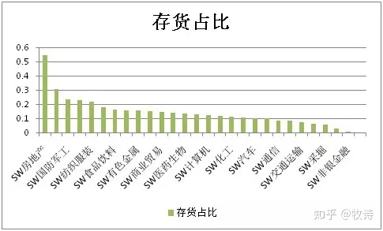
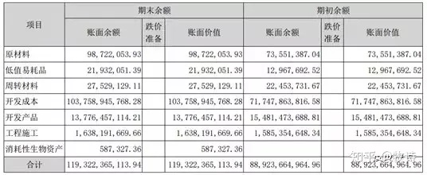
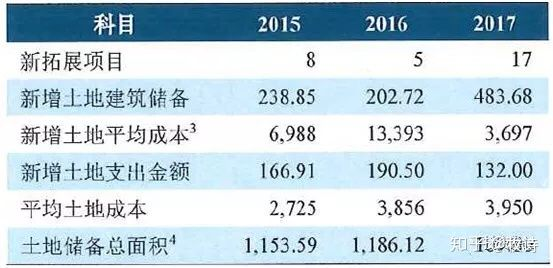

## 地产：没有什么比存货更重要

房地产属于高负债、高流动性的行业，存货科目决定了房地产企业的资产变现能力、盈利能力和偿债能力。从地产企业报表中存货所占比重可见其重要性。截至2018年12月底，存货在资产总额中的比重达到了54.31%，位列所有行业首位，远高于第二名综合行业的30.41%。

因此，对于房企报表分析，如果只能看一个科目，那我选存货。

## 地产存货：核算哪些内容？

对于地产企业而言，根据所涉及的业务，存货可以分为房地产存货和非房地产存货。

房地产存货中最重要的是开发成本和开发产品。开发成本包括拟开发产品和在建开发产品。拟开发产品是指已经购入的、决定用来开发为已完工开发产品的土地；在建开发产品是指尚未建成，以出售为目的的物业。

如果一个项目是整体开发，那么拟开发产品全部转入在建开发产品；如果是分期开发，那么就将分期开发所用土地转入在建开发产品，后期还没开发的土地仍留在拟开发产品。

在购买土地的时候，土地出让款项一般是分期支付的，如果钱已经付了但土地证尚未办理，则是借记预付账款，贷记银行存款，待办理完土地证后借记存货-拟开发产品，贷记预付账款；

如果是已经办理土地证但尚未支付土地款，则借记存货-拟开发产品，贷记应付账款，付完钱后则借记应付账款，贷记银行存款。一般来说，对于未支付的土地出让金在财务报表附注中作为承诺事项进行披露。

上面是一些书面的会计语言的解释。

其实开发成本说白了就是用来核算买来的地（拟开发产品）、把土地变成房子所要的开支以及在建造房子过程中产生的借贷利息（在建开发产品）。

开发产品说白了就是已经造好可以交付的房子的成本，这部分马上会转为收入。

以荣盛发展为例，其披露较为笼统，未将开发成本进行拆分。2017年年报显示，开发成本1037.59亿元，占比86.96%；开发产品137.76亿元，占比11.55%。二者合计占存货的比重为98.51%。

招商蛇口的存货披露则更为详细，将开发成本分成了拟开发产品和在建开发产品（土地开发成本是招商蛇口的一级土地开发业务，用来核算取得土地并将其平整改造达到出让条件所发生的支出）。

根据2017年年报，拟开发产品（土地）223.70亿元，占比13.61%；在建开发产品1130.65亿元，占比68.79%；已完工开发产品249.09亿，占比15.16%。三者合计占比97.56%。

## 地产存货，相关财务指标的运用

（1）营运效率

通常我们使用存货周转率来衡量企业的运营效率，该指标反应企业将存货转变为销售收入的速度。一般企业的存货主要是产成品，只要完成销售符合收入确认条件就可以结转确认收入。

但是对于地产企业而言，由于存在预售制度，企业在房子还没盖好的情况下（在建开发产品）就可以进行销售，销售出去的金额进入企业负债中的预收账款科目，预收账款是已经卖掉但尚未结转成销售收入的金额，这部分预售款需要等到房子造好验收合格交付客户后才能转化为地产企业的收入。

因而用传统的存货周转率会低估企业的运营效率。可以用存货/平均预收账款来似衡量企业的存货的去化速度。

（2）偿债能力

对于房地产企业而言，存货主要就是买来的地、正在盖的房子和已经盖好的房子，是最具流动性和变现价值的资产，其流动性远远高于一般企业的存货。

企业通过预售制度将还未造好的房子进行销售，回笼资金，用于偿还债务或者是继续拿地造房子。因此可以用存货来构建偿债指标，地产企业的长期偿债能力除了传统企业的衡量指标外，我觉得也可以用如下指标来进行衡量，即（存货+货币资金-预收账款）/总债务。

总债务是企业总的有息债务，包括短期借款+应付票据+应付短期融资券+其他流动负债+一年内到期的非流动负债+长期借款+应付债券。这个指标的意思就是把还未预售的存货（包括土地）变现后加上账上货币资金对企业全部有息债务的覆盖程度。指标越高说明偿债能力越强。

## 地产存货：需要关注哪些方面？

关于存货分析的重点，这里在做进一步说明。在债券募集说明书或者企业年报里面都会披露存货的明细，包括开发成本和开发产品的明细，会具体到每一个房产项目。

（1）存货的分布

土地储备的分布是决定存货变现能力的最重要因素，所谓买房的要诀“地段、地段还是地段”就是这个道理。

中国未来的经济发展将是围绕着都市圈展开，因此对于土地储备的分布我们不必拘泥于传统的一二三线城市的划分方法，更多的是关注是否分布在都市圈里面，是否能受到都市圈内核心城市的辐射。

比较有发展潜力的都市圈包括京津冀、长三角、珠三角、长江中游城市群和成渝都市圈。都市圈往往具备便捷的交通、完善的产业基础、持续的人口流入、公平的市场环境，为房地产市场的发展奠定了重要基础。因此，我们应当通过财务报表附注披露的开发成本和开发产品明细，分析企业存货在几大都市圈的分布情况以及在都市圈内不同能级城市所占的比重。

企业重仓的城市需要进行更细致的研究，包括市场情况、竞争对手、房价走势等。尤其是在债券存续期内，企业重点推货的城市分布。

（2）存货的成本

主要是指要考察取得土地的价格，土地不仅要位置好，还要以合适的价格买入。一个好地块，如果是高价买入的，往往会导致企业最终低利润甚至亏损，对企业资金形成占用。尤其是中小型房企，如果在不合适的时点以高价拿地，那么会给企业现金流造成很大压力，甚至影响企业的生存。

对于土地价格，可以看新增土地楼面价/当年销售均价或者存量土地楼面价/近三年平均销售价格等指标来考察，既可以从整体层面考察，也可以从区域角度进行分析。

如果这个比值比较低，说明地价占售价的比重较低，公司有较高的安全边际，或者说盈利空间比较大，有足够的空间能够应对政策或市场的波动。因为建安成本是比较固定的，土地成本是很大的变量，谁的土地成本较低，谁就更具有优势。

地价高低不仅与企业对市场的判断有关，还与拿地方式有关。招拍挂是一种公开竞争的方式，过去土地市场好的时候，溢价率非常高，如今限价政策使得土地市场趋于理性，合作拿地的方式也更加普遍；旧城改造、收并购等方式拿地成本相对较低，但其周期较长，可能有较为复杂的法律、政策等方面的风险.

这是某个房企评级报告披露的信息。

（3）存货的规模

存货规模过大或者过小都不合适。存货规模过小，地产企业可能由于土地储备不足而出现被动补库存的情况；如果存货规模增长过快，企业可能会由于过于激进的拿地政策导致债务攀升过快，后续若销售不畅或者遭遇政策收紧，可能导致现金流吃紧的风险。

那么，如何判断企业的存货规模是否合适呢？

▲是看存货和销售的比值。

一般企业储备的土地要足够其3年左右的开发，否则过少的土地资源意味着企业发展后劲不足，可能面临着被动补库存的情况，这样其就会被动去拿地；

▲是看存货的增长速度及其占总资产的比重。

如果拿地比较多，企业的存货就会显著增长。需要看企业增加土地储备的原因，是否是在合适的时候进行了扩张；

▲是看存货的构成。

房企存货主要就是土地（拟建开发产品）、在建的房子（在建开发产品）和建好的房子（开发产品），需要看这三者的比重。如果开发产品占比过高，需要关注具体的原因，是否是由于销售不畅所致（因为开发产品占比一般不会过高，因为都是预售制度，如果这一比例突然上升，需要了解具体原因）。

（4）存货的受限

存货往往被企业用于开发贷等融资的抵质押资产，因此普遍存在受限情况，需要分析企业存货的受限程度及其对企业再融资的影响。

（5）存货的减值

存货每年需要进行减值测试，当可变现净值小于账面价值的时候，就要计提减值准备。当减值情况消失的时候，减值准备是可以转回的。

由于过去房地产价格呈现单边上涨的趋势，因此地产企业的存货减值占比并不高，并不需要重点关注。后续随着不同区域和城市房价的波动，房地产企业的存货减值可能会呈现增多的趋势，需要予以关注。

同时，过多的存货减值有可能说明企业在土地投资策略、市场判断等方面存在问题，需要综合分析判断。

## 未来五年的发展方向

近日，金科股份发布了《金科地产集团股份有限公司发展战略规划纲要（2021-2025 年）》，明确了未来五年的发展方向。文中关于“预计未来中国房地产市场会出现以下五大趋势特征”，代表了头部房企对市场未来的预判，值得学习和借鉴。我们听惯了各种“专家”的言论，看看行内企业对市场的理解吧。

### 第一，房地产市场总量稳定，仍将保持按年微升趋势，预计 2030年至少会达到 18 万亿的市场规模，行业 TOP10 企业市场集中度将进一步提升至 35-40%，因此我们仍应保持战略定力，坚持主业做大做强，持续保持稳健增长。

当前各种论调，都认为房地产开发的市场规模已经进入了下滑阶段，对地产行业的永续性表示怀疑，对房企的未来成长空间并不看好。我个人预计未来是量缩价涨的态势，随着城市成熟区域的土地供给不足，大量购买力只能在二手市场释放，导致新房成交量下滑，但房价的持续上升会继续提升总量。

18万亿的规模，比今年可能实现的16.5万亿~17万亿略高，是一个合理的预期。2030年能否保持，除了房价是否达到效果外，很重要一点是保障房的供应量，这会对商品房土地供应产生很大影响，是此消彼长的过程。

TOP10房企，如果达到35-40%的占比，会有6.3万亿到7.2万亿的总销售额。与2019年3.45万亿的总权益销售额相比，有一倍的提升空间。十年一倍，看起来空间不是特别大，但这个放缓增速的过程，收入与成本的错配会更加合理，负债成本也会大幅降低，再加上持有型物业的经营利润和其他多元化收益，TOP10房企的利润增速达到10%~15%之间是正常的，接近现在贵州茅台的利润增速。

### 第二，未来房地产行业将由规模化竞争进入差异化竞争阶段，预计头部房企的销售增速将整体放缓至 5%-15%。未来房地产增量主要由价格驱动，改善型需求占比持续提升，产品力将成为关注重点，公 司需将提升产品力作为未来发展的核心动力。

房地产行业正由规模化竞争进入差异化竞争阶段，三道红线会加快这一进度。简单粗暴的拼负债、拼规模的时代过去了，只有根据市场消费群体的需求变化，而不断调整自己的产品思路，才能更好地迎接新规则。

产品力突出的企业，在未来的竞争中会具有更大优势。房子同质化，实际上是过去20年过快发展带给市场的伪命题。不同的地块，不同的购买群体，是有着不同的产品需求的，个性化主题会是未来市场的趋势。

未来的产品不仅仅是建筑质量更好，小区规划更合理，科技应用和景观营造都会有很大的提升，物业服务更会成为提升居住体验的重要环节。对一些超级房企来说，有足够大的土地规模，更可以在小区外的大环境和大配套上，为业主提供和老旧城区完全不一样的建筑贡献，这是普通房企只能望洋兴叹的。

什么是房地产的需求侧改革？让你的房子住起来和别人的不一样，这会是住宅消费需求侧改革的重要部分。

### 第三，数字化已经在房企价值链的各个环节开始渗透，未来将持续给房企的运营模式带来颠覆。因此我们要积极探索新一代信息技术与房地产上下游各个环节深度融合，全面提升经营质效。

随着体量的迅猛增长，很多房企的管理体系也需要随之提升。对经营规模数千亿的大房企来说，某一个环节的有效改善，对利润的提升可能就是数千万甚至上亿的。

过往，高歌猛进的时代，管理能力的提升一直落后于业务规模的增长，而过快的业绩增长也让很多企业不重视内部管理的严谨性。数字化时代对企业经营模式和管理效率的促进，在各行各业中都已经体现的很明显，房企也将普遍收益。

### 第四，伴随金融环境改善、消费升级和资本市场的成熟，优质持有型物业的估值水平将会逐步提升，未来经营型房企将在企业价值上领先于销售型房企。房企要逐步增加优质物业的持有比例，提升持有型物业经营利润占总体利润比重，实现资产结构优化，提升企业价值。

我最近常说一句话，“招拍挂时代过去了”！尽管还有很多人不信，但这已经是行业公认的事实。头部企业，大部分都在打造自己的商业品牌，同时在文旅、产业等方面不断延伸能力圈，原因就是这句话“**未来经营型房企将在企业价值上领先于销售型房企”。**

持有型物业不是低效资产，而是未来长期稳定发展的通行证，这是头部房企的群体选择。总有人喜欢教这些千亿级房企怎么做开发，就像总有人喜欢教梅西怎么踢足球。

### 第五，以美日为代表的发达经济体的房地产企业都善于捕捉不同阶段市场需求，不断丰富相关多元化产品组合，拓展创新业务领域，从而获得穿越房地产周期，实现永续经营的能力。

房地产绝不是只有“地段、地段和地段”，如果说过去是因为房屋供给总量长期低于需求总量，导致的不平衡、不充分，那么未来我们在数量上的缺口会随着保障房的大增而不断缩小，但不同市场周期中，不同需求的变化，会不断提供市场机遇。

当前的商品房是单一的，基本都是依托于城市现有公共配套，摊大饼式不断外延发展，住宅、商业和办公楼都是如此。未来的房屋类型将会更加多元化，并将随着轨道交通和网络技术的发展，而更加趋向于多中心化。养老、度假、会展、特色小镇、产业园区、新型城镇化等等，正在构建一个泛城市化的开发体系。地理坐标的破除，会让大量低价土地成为房企的新阵地，当然这对房企的综合能力要求会更高，只会盖房子肯定是不行的。

### 综上所述，我国房地产行业未来仍有较大的发展空间，但行业集中度越来越高并快速提升，房地产企业必须提升经营质效，增强综合实力才能在行业中拥有一席之地。

地产开发行业的增速虽然会下降，但仍然会在很长时间里保持在绝对高位，而这个过程中头部企业将迎来稳定的利润增长期。市场对房企的预期，也会随着财务的趋于稳健和业绩的不断释放而发生变更，今年在地产股整体低迷的大背景下，龙湖集团的强势就是一个很好的佐证。

未来，掌握在房企手中，过去20年的发展模式需要与时俱进了，只有“提升经营质效，增强综合实力才能在行业中拥有一席之地”，这句话是选择地产股的关键。

## 房地产企业销售数据口径辨析

### 销售的全口径金额

也称为合同销售额，现在上市公司每个月披露的就是这个金额。所有参股企业均可以将100%的销售额计入自己的销售业绩。这种口径，会造成大量重复。克而瑞披露全口径销售的排名。如果一家企业，有大量的低持股比例的项目，这个排名参考意义就不太大。

### 销售的权益金额

是指房地产开发企业在具体项目中的权益占比所对应的销售业绩。这个是实打实，没有水份的业绩。克而瑞披露权益销售的排名

### 权益占全口径金额的比重越小，少数股东损益占比就越大吗？

不一定，只有并表的项目才会产生少数股东损益，未并表的项目只会产生投资收益。如果一家企业是这样的，1000万的全口径金额，其中500万达到并表要求，权益占比90%，另外500万未达到并表要求，权益占比是10%，则总的权益金额是500万，占比很低了。假定净利率是10%，不考虑所得税，则利润表的表现是：销售收入500万（只计并表部分），投资收益有5万（未并表部分），净利润55万，其中归母净利是50万（未并表部分的投资收益及并表部分归母利润），少数股东损益5万（并表部分，归少数股东所有的部分）。虽然权益占比只有50%，但归母净利占比远超50%。

### 全口径金额增加了，结算后，会不会一定导致销售收入增加？

不一定，合并报表只计并表项目的结算金额。全口径金额增加了，但并表部分未增加，也是有可能的。比如说增加了大量的非并表项目。

### 观察合并报表中的销售收入，然后观察两年前的权益销售额，发现销售收入占权益销售的比例较低，能不能判断有大量项目未结算？

不能，因为如果以前的销售收入有大量的非并表项目，这些项目的结算会体现在投资收益中，而不是体现在销售收入中。准确的数据还是要看报表的中各项目的结算情况。

### 真实的销售净利率如何考量？

用合并利润表的净利润除以销售收入可行不？不可行，因为合并报表的销售收入是并表项目的，而净利润包括了非并表项目。这样导致计算结果偏高。用归母净利除以销售收入是否可行？同样不可行，原因同上。**可行的方法是用净利润减去投资收益，然后除以销售收入。或者，如果能找到当年结算的权益金额，用归母净利除以权益金额也是可行的。**

**看一家房企的发展，要估算出一个销售净利率，然后观察权益销售金额的增长**

## 参考资料

https://zhuanlan.zhihu.com/p/62718891

[行业整体研究报告1](assets/1532921165112.pdf)

[房地产行业研究框架报告](assets/1625d21283225d353feb2bae.pdf)

https://xueqiu.com/6056806984/166202529